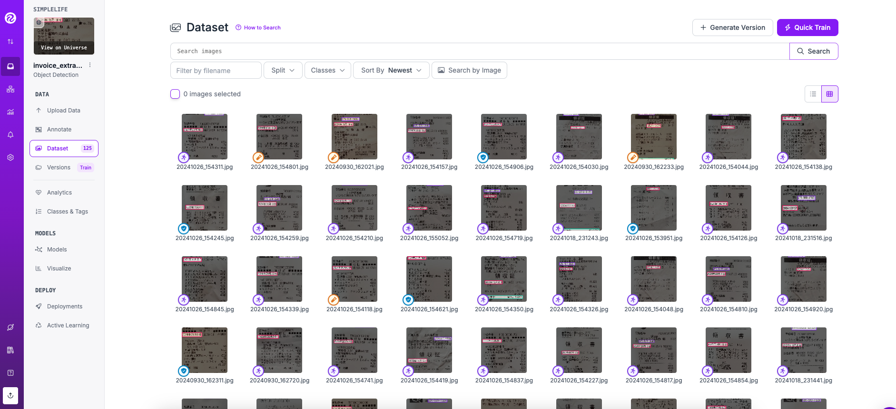
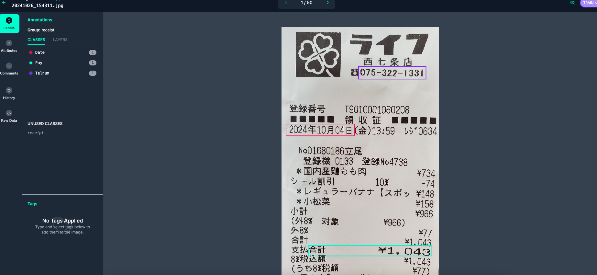
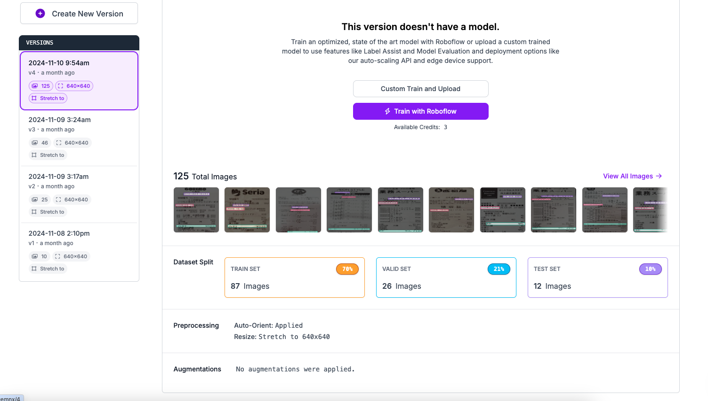

# YOLOv9を使用して領収証認識システムを構築する 

## Summary

<div style="max-width: 600px; word-wrap: break-word;">


進化し続ける人工知能（AI）と機械学習の分野において、領収書から重要な情報を効率的かつ正確に抽出する能力は、ビジネスにとってますます重要になっています。本記事では、YOLO v9モデルを使用して、スーパーでの買い物領収書を認識するシステムの構築方法について説明します。この記事では、約130枚の領収書を収集し、3つのラベル（クラス）を付けてデータをアノテーションし、モデルをトレーニングしました。その結果、YOLO v9モデルは指定した3つのクラスを正確に認識することができました

このプロジェクトは、YOLOv9を参考にして作成されています。詳細については以下のリポジトリをご参照ください：
https://github.com/WongKinYiu/yolov9

</div>


## はじめに

### YOLO v9について
<div style="max-width: 600px; word-wrap: break-word;">

YOLOは「You Only Look Once」の略で、速度と精度の高さで知られる最先端のオブジェクト検出モデルです。このモデルの第9バージョン（v9）は、「Programmable Gradient Information（PGI）」や「Generalized Efficient Layer Aggregation Network（GELAN）」といった新しいアーキテクチャを導入し、機能と性能がさらに強化されています。YOLO v9は、モデルの学習能力を向上させるだけでなく、検出プロセス全体で重要な情報を保持することを可能にし、卓越した精度と性能を実現しています。この記事はYOLO v9モデルを使用して、スーパーでの買い物領収書を認識するシステムの構築

</div>


## 準備

### 環境を選ぶ
<div style="max-width: 600px; word-wrap: break-word;">

#### トーレニングはGoogle Colabを使用します。

Google Colabは、GPUへの無料アクセスを提供するクラウドベースのプラットフォームであり、ディープラーニングモデルのトレーニングに最適な選択肢です。


#### データ準備

データの準備は最初のステップです。アノテーションツールにはいくつかの選択肢がありますが、その中でもLabelImgやLabelmeを使用した経験があります。ただし、Roboflowは非常に使いやすいツールです。今回は135枚の領収書を収集し、それらをRoboflowを使ってアノテーションしました。

Roboflowについて
Roboflowはデータセットのアノテーションを簡単かつ迅速に行い、さまざまなモデルのトレーニングに適した形式に変換できるソリューションを提供しています。無料で利用可能なRoboflowのパブリックバージョンを使用することができます。https://app.roboflow.com/

<div align="medium">
    
</div>

ここでは、135枚の領収書サンプルをRoboflowアカウントにアップロードしてアノテーションを行います。このプロジェクトでは、領収書から以下の3つのラベルを抽出します：『会社ロゴ』、『領収書合計』、『領収書の日付』、『店の電話』。そのため、それぞれのラベル名を入力し、各領収書サンプルのアノテーションを作ります。

<div align="medium">
    


アノテーションが完了したら、いくつかの前処理を行います。例えば、データセットを訓練用、検証用、テスト用に分割することや、画像の拡張（既存の画像から新しい訓練用サンプルを作成するプロセス）を行います。拡張手法としては、彩度の調整、反転、グレースケール変換などがあります。また、画像を640x640サイズにリサイズします（現在のYOLO v9は640x640サイズの画像しか処理できないため、このステップは必須です）。

これらの前処理を行った結果、データセットの87枚が訓練用、26枚を検証用、12枚はテスト用として準備されました。


<div align="medium">
    

</div>


</div>


Mount your Google Drive for storage


```python
from google.colab import drive
drive.mount('/content/drive')
```

    Mounted at /content/drive


## Before you start

Check GPU access. Use `nvidia-smi` for that. In case of any problems navigate to `Connect` -> `Change Runtime Type` -> `Hardware accelerator`, set it to `T4 GPU`, and then click `Save`.


```python
!nvidia-smi
```

    Sat Nov  9 03:37:18 2024       
    +---------------------------------------------------------------------------------------+
    | NVIDIA-SMI 535.104.05             Driver Version: 535.104.05   CUDA Version: 12.2     |
    |-----------------------------------------+----------------------+----------------------+
    | GPU  Name                 Persistence-M | Bus-Id        Disp.A | Volatile Uncorr. ECC |
    | Fan  Temp   Perf          Pwr:Usage/Cap |         Memory-Usage | GPU-Util  Compute M. |
    |                                         |                      |               MIG M. |
    |=========================================+======================+======================|
    |   0  Tesla T4                       Off | 00000000:00:04.0 Off |                    0 |
    | N/A   52C    P8              10W /  70W |      0MiB / 15360MiB |      0%      Default |
    |                                         |                      |                  N/A |
    +-----------------------------------------+----------------------+----------------------+
                                                                                             
    +---------------------------------------------------------------------------------------+
    | Processes:                                                                            |
    |  GPU   GI   CI        PID   Type   Process name                            GPU Memory |
    |        ID   ID                                                             Usage      |
    |=======================================================================================|
    |  No running processes found                                                           |
    +---------------------------------------------------------------------------------------+


**NOTE:** To make it easier for us to manage datasets, images and models we create a `HOME` constant.


```python
import os
HOME = os.getcwd()
print(HOME)
```

    /content


## Clone and Install

Clone YOLO v9 repository into your Google Drive.


```python
!git clone https://github.com/SkalskiP/yolov9.git
%cd yolov9
!pip install -r requirements.txt -q
```

    Cloning into 'yolov9'...
    remote: Enumerating objects: 325, done.
    remote: Total 325 (delta 0), reused 0 (delta 0), pack-reused 325 (from 1)
    Receiving objects: 100% (325/325), 2.25 MiB | 5.37 MiB/s, done.
    Resolving deltas: 100% (162/162), done.
    /content/yolov9
       ━━━━━━━━━━━━━━━━━━━━━━━━━━━━━━━━━━━━━━━━ 1.6/1.6 MB 26.9 MB/s eta 0:00:00
    [?25h

**NOTE:** Install roboflow package for importing dataset


```python
!pip install -q roboflow
```

       ━━━━━━━━━━━━━━━━━━━━━━━━━━━━━━━━━━━━━━━━ 80.9/80.9 kB 5.6 MB/s eta 0:00:00
       ━━━━━━━━━━━━━━━━━━━━━━━━━━━━━━━━━━━━━━━━ 66.8/66.8 kB 5.5 MB/s eta 0:00:00
    [?25h

## Imports


```python
import roboflow

from IPython.display import Image
```

## Download model weights

Download available YOLO model weights from the github repo


```python
!mkdir -p {HOME}/weights
```


```python
!wget -P {HOME}/weights -q https://github.com/WongKinYiu/yolov9/releases/download/v0.1/yolov9-c.pt
!wget -P {HOME}/weights -q https://github.com/WongKinYiu/yolov9/releases/download/v0.1/yolov9-e.pt
!wget -P {HOME}/weights -q https://github.com/WongKinYiu/yolov9/releases/download/v0.1/gelan-c.pt
!wget -P {HOME}/weights -q https://github.com/WongKinYiu/yolov9/releases/download/v0.1/gelan-e.pt
```


```python
!ls -la {HOME}/weights
```

    total 402448
    drwxr-xr-x 2 root root      4096 Nov  9 03:38 .
    drwxr-xr-x 1 root root      4096 Nov  9 03:38 ..
    -rw-r--r-- 1 root root  51508261 Feb 18  2024 gelan-c.pt
    -rw-r--r-- 1 root root 117203713 Feb 18  2024 gelan-e.pt
    -rw-r--r-- 1 root root 103153312 Feb 18  2024 yolov9-c.pt
    -rw-r--r-- 1 root root 140217688 Feb 18  2024 yolov9-e.pt


## Download the Dataset

**NOTE:** The dataset must be saved inside the `{HOME}/yolov9` directory, otherwise, the training will not succeed. Paste your YOLO v9 export dataset code from the roboflow here


```python
%cd {HOME}/yolov9


!pip install roboflow

from roboflow import Roboflow
rf = Roboflow(api_key="YMynYD3vFskFi5oZwlSk")
project = rf.workspace().project("invoice_extraction-9emnx")
version = project.version(3)
dataset = version.download("yolov9")


```

    /content/yolov9
    Requirement already satisfied: roboflow in /usr/local/lib/python3.10/dist-packages (1.1.49)
    Requirement already satisfied: certifi in /usr/local/lib/python3.10/dist-packages (from roboflow) (2024.8.30)
    Requirement already satisfied: idna==3.7 in /usr/local/lib/python3.10/dist-packages (from roboflow) (3.7)
    Requirement already satisfied: cycler in /usr/local/lib/python3.10/dist-packages (from roboflow) (0.12.1)
    Requirement already satisfied: kiwisolver>=1.3.1 in /usr/local/lib/python3.10/dist-packages (from roboflow) (1.4.7)
    Requirement already satisfied: matplotlib in /usr/local/lib/python3.10/dist-packages (from roboflow) (3.8.0)
    Requirement already satisfied: numpy>=1.18.5 in /usr/local/lib/python3.10/dist-packages (from roboflow) (1.26.4)
    Requirement already satisfied: opencv-python-headless==4.10.0.84 in /usr/local/lib/python3.10/dist-packages (from roboflow) (4.10.0.84)
    Requirement already satisfied: Pillow>=7.1.2 in /usr/local/lib/python3.10/dist-packages (from roboflow) (10.4.0)
    Requirement already satisfied: python-dateutil in /usr/local/lib/python3.10/dist-packages (from roboflow) (2.8.2)
    Requirement already satisfied: python-dotenv in /usr/local/lib/python3.10/dist-packages (from roboflow) (1.0.1)
    Requirement already satisfied: requests in /usr/local/lib/python3.10/dist-packages (from roboflow) (2.32.3)
    Requirement already satisfied: six in /usr/local/lib/python3.10/dist-packages (from roboflow) (1.16.0)
    Requirement already satisfied: urllib3>=1.26.6 in /usr/local/lib/python3.10/dist-packages (from roboflow) (2.2.3)
    Requirement already satisfied: tqdm>=4.41.0 in /usr/local/lib/python3.10/dist-packages (from roboflow) (4.66.6)
    Requirement already satisfied: PyYAML>=5.3.1 in /usr/local/lib/python3.10/dist-packages (from roboflow) (6.0.2)
    Requirement already satisfied: requests-toolbelt in /usr/local/lib/python3.10/dist-packages (from roboflow) (1.0.0)
    Requirement already satisfied: filetype in /usr/local/lib/python3.10/dist-packages (from roboflow) (1.2.0)
    Requirement already satisfied: contourpy>=1.0.1 in /usr/local/lib/python3.10/dist-packages (from matplotlib->roboflow) (1.3.0)
    Requirement already satisfied: fonttools>=4.22.0 in /usr/local/lib/python3.10/dist-packages (from matplotlib->roboflow) (4.54.1)
    Requirement already satisfied: packaging>=20.0 in /usr/local/lib/python3.10/dist-packages (from matplotlib->roboflow) (24.1)
    Requirement already satisfied: pyparsing>=2.3.1 in /usr/local/lib/python3.10/dist-packages (from matplotlib->roboflow) (3.2.0)
    Requirement already satisfied: charset-normalizer<4,>=2 in /usr/local/lib/python3.10/dist-packages (from requests->roboflow) (3.4.0)
    loading Roboflow workspace...
    loading Roboflow project...
    Exporting format yolov9 in progress : 85.0%
    Version export complete for yolov9 format


    Downloading Dataset Version Zip in invoice_extraction-3 to yolov9:: 100%|██████████| 2830/2830 [00:00<00:00, 9330.49it/s]

    


    
    Extracting Dataset Version Zip to invoice_extraction-3 in yolov9:: 100%|██████████| 104/104 [00:00<00:00, 4734.59it/s]


## Train YOLO Model on Invoices

We are training our dataset with the gelan-c model. Before training, please access the gelan-c.yaml file and change the no. of anchors into the labels you need to train. Here we are training for only 4 labels so change anchors into 4


```python
%cd {HOME}/yolov9

!python train.py \
--batch 8 --epochs 100 --img 640 --device 0 --min-items 0 --close-mosaic 15 \
--data invoice_extraction-3/data.yaml \
--weights {HOME}/weights/gelan-c.pt \
--cfg models/detect/gelan-c.yaml \
--hyp hyp.scratch-high.yaml
```

    /content/yolov9
    2024-11-09 03:53:08.629063: E external/local_xla/xla/stream_executor/cuda/cuda_fft.cc:485] Unable to register cuFFT factory: Attempting to register factory for plugin cuFFT when one has already been registered
    2024-11-09 03:53:08.661254: E external/local_xla/xla/stream_executor/cuda/cuda_dnn.cc:8454] Unable to register cuDNN factory: Attempting to register factory for plugin cuDNN when one has already been registered
    2024-11-09 03:53:08.671039: E external/local_xla/xla/stream_executor/cuda/cuda_blas.cc:1452] Unable to register cuBLAS factory: Attempting to register factory for plugin cuBLAS when one has already been registered
    2024-11-09 03:53:08.692904: I tensorflow/core/platform/cpu_feature_guard.cc:210] This TensorFlow binary is optimized to use available CPU instructions in performance-critical operations.
    To enable the following instructions: AVX2 AVX512F FMA, in other operations, rebuild TensorFlow with the appropriate compiler flags.
    2024-11-09 03:53:10.477275: W tensorflow/compiler/tf2tensorrt/utils/py_utils.cc:38] TF-TRT Warning: Could not find TensorRT
    wandb: Using wandb-core as the SDK backend. Please refer to https://wandb.me/wandb-core for more information.
    wandb: (1) Create a W&B account
    wandb: (2) Use an existing W&B account
    wandb: (3) Don't visualize my results
    wandb: Enter your choice: (30 second timeout) 1
    wandb: You chose 'Create a W&B account'
    wandb: Create an account here: https://wandb.ai/authorize?signup=true
    wandb: Paste an API key from your profile and hit enter, or press ctrl+c to quit: 
    wandb: Appending key for api.wandb.ai to your netrc file: /root/.netrc
    train: weights=/content/weights/gelan-c.pt, cfg=models/detect/gelan-c.yaml, data=invoice_extraction-3/data.yaml, hyp=hyp.scratch-high.yaml, epochs=100, batch_size=8, imgsz=640, rect=False, resume=False, nosave=False, noval=False, noautoanchor=False, noplots=False, evolve=None, bucket=, cache=None, image_weights=False, device=0, multi_scale=False, single_cls=False, optimizer=SGD, sync_bn=False, workers=8, project=runs/train, name=exp, exist_ok=False, quad=False, cos_lr=False, flat_cos_lr=False, fixed_lr=False, label_smoothing=0.0, patience=100, freeze=[0], save_period=-1, seed=0, local_rank=-1, min_items=0, close_mosaic=15, entity=None, upload_dataset=False, bbox_interval=-1, artifact_alias=latest
    YOLOv5 🚀 1e33dbb Python-3.10.12 torch-2.5.0+cu121 CUDA:0 (Tesla T4, 15102MiB)
    
    hyperparameters: lr0=0.01, lrf=0.01, momentum=0.937, weight_decay=0.0005, warmup_epochs=3.0, warmup_momentum=0.8, warmup_bias_lr=0.1, box=7.5, cls=0.5, cls_pw=1.0, dfl=1.5, obj_pw=1.0, iou_t=0.2, anchor_t=5.0, fl_gamma=0.0, hsv_h=0.015, hsv_s=0.7, hsv_v=0.4, degrees=0.0, translate=0.1, scale=0.9, shear=0.0, perspective=0.0, flipud=0.0, fliplr=0.5, mosaic=1.0, mixup=0.15, copy_paste=0.3
    ClearML: run 'pip install clearml' to automatically track, visualize and remotely train YOLO 🚀 in ClearML
    Comet: run 'pip install comet_ml' to automatically track and visualize YOLO 🚀 runs in Comet
    TensorBoard: Start with 'tensorboard --logdir runs/train', view at http://localhost:6006/
    wandb: Currently logged in as: forsimplielie (forsimplielie-line). Use `wandb login --relogin` to force relogin
    wandb: Tracking run with wandb version 0.18.5
    wandb: Run data is saved locally in /content/yolov9/wandb/run-20241109_035650-d8li1rnd
    wandb: Run `wandb offline` to turn off syncing.
    wandb: Syncing run glorious-sponge-1
    wandb: ⭐️ View project at https://wandb.ai/forsimplielie-line/YOLOv5
    wandb: 🚀 View run at https://wandb.ai/forsimplielie-line/YOLOv5/runs/d8li1rnd
    /content/yolov9/train.py:108: FutureWarning: You are using `torch.load` with `weights_only=False` (the current default value), which uses the default pickle module implicitly. It is possible to construct malicious pickle data which will execute arbitrary code during unpickling (See https://github.com/pytorch/pytorch/blob/main/SECURITY.md#untrusted-models for more details). In a future release, the default value for `weights_only` will be flipped to `True`. This limits the functions that could be executed during unpickling. Arbitrary objects will no longer be allowed to be loaded via this mode unless they are explicitly allowlisted by the user via `torch.serialization.add_safe_globals`. We recommend you start setting `weights_only=True` for any use case where you don't have full control of the loaded file. Please open an issue on GitHub for any issues related to this experimental feature.
      ckpt = torch.load(weights, map_location='cpu')  # load checkpoint to CPU to avoid CUDA memory leak
    Overriding model.yaml nc=80 with nc=2
    
                     from  n    params  module                                  arguments                     
      0                -1  1      1856  models.common.Conv                      [3, 64, 3, 2]                 
      1                -1  1     73984  models.common.Conv                      [64, 128, 3, 2]               
      2                -1  1    212864  models.common.RepNCSPELAN4              [128, 256, 128, 64, 1]        
      3                -1  1    164352  models.common.ADown                     [256, 256]                    
      4                -1  1    847616  models.common.RepNCSPELAN4              [256, 512, 256, 128, 1]       
      5                -1  1    656384  models.common.ADown                     [512, 512]                    
      6                -1  1   2857472  models.common.RepNCSPELAN4              [512, 512, 512, 256, 1]       
      7                -1  1    656384  models.common.ADown                     [512, 512]                    
      8                -1  1   2857472  models.common.RepNCSPELAN4              [512, 512, 512, 256, 1]       
      9                -1  1    656896  models.common.SPPELAN                   [512, 512, 256]               
     10                -1  1         0  torch.nn.modules.upsampling.Upsample    [None, 2, 'nearest']          
     11           [-1, 6]  1         0  models.common.Concat                    [1]                           
     12                -1  1   3119616  models.common.RepNCSPELAN4              [1024, 512, 512, 256, 1]      
     13                -1  1         0  torch.nn.modules.upsampling.Upsample    [None, 2, 'nearest']          
     14           [-1, 4]  1         0  models.common.Concat                    [1]                           
     15                -1  1    912640  models.common.RepNCSPELAN4              [1024, 256, 256, 128, 1]      
     16                -1  1    164352  models.common.ADown                     [256, 256]                    
     17          [-1, 12]  1         0  models.common.Concat                    [1]                           
     18                -1  1   2988544  models.common.RepNCSPELAN4              [768, 512, 512, 256, 1]       
     19                -1  1    656384  models.common.ADown                     [512, 512]                    
     20           [-1, 9]  1         0  models.common.Concat                    [1]                           
     21                -1  1   3119616  models.common.RepNCSPELAN4              [1024, 512, 512, 256, 1]      
     22      [15, 18, 21]  1   5492182  models.yolo.DDetect                     [2, [256, 512, 512]]          
    gelan-c summary: 621 layers, 25438614 parameters, 25438598 gradients, 103.2 GFLOPs
    
    Transferred 931/937 items from /content/weights/gelan-c.pt
    AMP: checks passed ✅
    optimizer: SGD(lr=0.01) with parameter groups 154 weight(decay=0.0), 161 weight(decay=0.0005), 160 bias
    albumentations: Blur(p=0.01, blur_limit=(3, 7)), MedianBlur(p=0.01, blur_limit=(3, 7)), ToGray(p=0.01, num_output_channels=3, method='weighted_average'), CLAHE(p=0.01, clip_limit=(1.0, 4.0), tile_grid_size=(8, 8))
    train: Scanning /content/yolov9/train/labels.cache... 32 images, 0 backgrounds, 0 corrupt: 100% 32/32 [00:00<?, ?it/s]
    val: Scanning /content/yolov9/valid/labels.cache... 10 images, 0 backgrounds, 0 corrupt: 100% 10/10 [00:00<?, ?it/s]
    Plotting labels to runs/train/exp2/labels.jpg... 
    /content/yolov9/train.py:244: FutureWarning: `torch.cuda.amp.GradScaler(args...)` is deprecated. Please use `torch.amp.GradScaler('cuda', args...)` instead.
      scaler = torch.cuda.amp.GradScaler(enabled=amp)
    Image sizes 640 train, 640 val
    Using 2 dataloader workers
    Logging results to runs/train/exp2
    Starting training for 100 epochs...
    
          Epoch    GPU_mem   box_loss   cls_loss   dfl_loss  Instances       Size
      0% 0/4 [00:00<?, ?it/s]/content/yolov9/train.py:302: FutureWarning: `torch.cuda.amp.autocast(args...)` is deprecated. Please use `torch.amp.autocast('cuda', args...)` instead.
      with torch.cuda.amp.autocast(amp):
           0/99      5.61G      4.701      12.77      3.419         25        640:   0% 0/4 [00:02<?, ?it/s]Exception in thread Thread-7 (plot_images):
    Traceback (most recent call last):
      File "/usr/lib/python3.10/threading.py", line 1016, in _bootstrap_inner
        self.run()
      File "/usr/lib/python3.10/threading.py", line 953, in run
        self._target(*self._args, **self._kwargs)
      File "/content/yolov9/utils/plots.py", line 300, in plot_images
        annotator.box_label(box, label, color=color)
      File "/content/yolov9/utils/plots.py", line 86, in box_label
        w, h = self.font.getsize(label)  # text width, height
    AttributeError: 'FreeTypeFont' object has no attribute 'getsize'
           0/99      5.61G      4.701      12.77      3.419         25        640:  25% 1/4 [00:07<00:22,  7.57s/it]/content/yolov9/train.py:302: FutureWarning: `torch.cuda.amp.autocast(args...)` is deprecated. Please use `torch.amp.autocast('cuda', args...)` instead.
      with torch.cuda.amp.autocast(amp):
           0/99      5.65G      4.856      10.94      3.663         36        640:  50% 2/4 [00:08<00:07,  3.50s/it]Exception in thread Thread-8 (plot_images):
    Traceback (most recent call last):
      File "/usr/lib/python3.10/threading.py", line 1016, in _bootstrap_inner
        self.run()
      File "/usr/lib/python3.10/threading.py", line 953, in run
        self._target(*self._args, **self._kwargs)
      File "/content/yolov9/utils/plots.py", line 300, in plot_images
        annotator.box_label(box, label, color=color)
      File "/content/yolov9/utils/plots.py", line 86, in box_label
        w, h = self.font.getsize(label)  # text width, height
    AttributeError: 'FreeTypeFont' object has no attribute 'getsize'
           0/99      5.65G      4.649      10.86      3.501         35        640:  75% 3/4 [00:08<00:02,  2.10s/it]Exception in thread Thread-9 (plot_images):
    Traceback (most recent call last):
      File "/usr/lib/python3.10/threading.py", line 1016, in _bootstrap_inner
        self.run()
      File "/usr/lib/python3.10/threading.py", line 953, in run
        self._target(*self._args, **self._kwargs)
      File "/content/yolov9/utils/plots.py", line 300, in plot_images
        annotator.box_label(box, label, color=color)
      File "/content/yolov9/utils/plots.py", line 86, in box_label
        w, h = self.font.getsize(label)  # text width, height
    AttributeError: 'FreeTypeFont' object has no attribute 'getsize'
           0/99      5.65G      4.596      11.48      3.426         19        640: 100% 4/4 [00:09<00:00,  2.28s/it]
                     Class     Images  Instances          P          R      mAP50   mAP50-95: 100% 1/1 [00:00<00:00,  2.65it/s]
                       all         10         20          0          0          0          0
    
          Epoch    GPU_mem   box_loss   cls_loss   dfl_loss  Instances       Size
           1/99      5.87G      4.958      11.39      3.695         35        640: 100% 4/4 [00:02<00:00,  1.46it/s]
                     Class     Images  Instances          P          R      mAP50   mAP50-95: 100% 1/1 [00:00<00:00,  4.13it/s]
                       all         10         20          0          0          0          0
    
          Epoch    GPU_mem   box_loss   cls_loss   dfl_loss  Instances       Size
           2/99      5.87G       5.05       13.5      3.571         33        640: 100% 4/4 [00:02<00:00,  1.78it/s]
                     Class     Images  Instances          P          R      mAP50   mAP50-95: 100% 1/1 [00:00<00:00,  4.65it/s]
                       all         10         20          0          0          0          0
    
          Epoch    GPU_mem   box_loss   cls_loss   dfl_loss  Instances       Size
           3/99      5.89G      4.756      9.224      3.537         35        640: 100% 4/4 [00:02<00:00,  1.78it/s]
                     Class     Images  Instances          P          R      mAP50   mAP50-95: 100% 1/1 [00:00<00:00,  4.23it/s]
                       all         10         20          0          0          0          0
    
          Epoch    GPU_mem   box_loss   cls_loss   dfl_loss  Instances       Size
           4/99      5.89G      4.887      8.569      3.509         29        640: 100% 4/4 [00:02<00:00,  1.87it/s]
                     Class     Images  Instances          P          R      mAP50   mAP50-95: 100% 1/1 [00:00<00:00,  4.65it/s]
                       all         10         20          0          0          0          0
    
          Epoch    GPU_mem   box_loss   cls_loss   dfl_loss  Instances       Size
           5/99       5.9G      4.506      6.467      3.289         33        640: 100% 4/4 [00:02<00:00,  1.89it/s]
                     Class     Images  Instances          P          R      mAP50   mAP50-95: 100% 1/1 [00:00<00:00,  4.38it/s]
                       all         10         20          0          0          0          0
    
          Epoch    GPU_mem   box_loss   cls_loss   dfl_loss  Instances       Size
           6/99      6.11G      4.146      5.465      2.901         40        640: 100% 4/4 [00:02<00:00,  1.42it/s]
                     Class     Images  Instances          P          R      mAP50   mAP50-95: 100% 1/1 [00:00<00:00,  3.80it/s]
                       all         10         20   0.000314       0.05   0.000185    3.7e-05
    
          Epoch    GPU_mem   box_loss   cls_loss   dfl_loss  Instances       Size
           7/99      6.11G      4.202      5.172      3.144         25        640: 100% 4/4 [00:02<00:00,  1.88it/s]
                     Class     Images  Instances          P          R      mAP50   mAP50-95: 100% 1/1 [00:00<00:00,  4.20it/s]
                       all         10         20   0.000636        0.1   0.000448   0.000161
    
          Epoch    GPU_mem   box_loss   cls_loss   dfl_loss  Instances       Size
           8/99      6.11G      3.437      4.524      2.607         18        640: 100% 4/4 [00:02<00:00,  1.71it/s]
                     Class     Images  Instances          P          R      mAP50   mAP50-95: 100% 1/1 [00:00<00:00,  4.49it/s]
                       all         10         20     0.0013        0.2    0.00169   0.000726
    
          Epoch    GPU_mem   box_loss   cls_loss   dfl_loss  Instances       Size
           9/99      6.11G       3.31      4.009      2.374         44        640: 100% 4/4 [00:02<00:00,  1.56it/s]
                     Class     Images  Instances          P          R      mAP50   mAP50-95: 100% 1/1 [00:01<00:00,  1.77s/it]
                       all         10         20    0.00269        0.4     0.0117    0.00465
    
          Epoch    GPU_mem   box_loss   cls_loss   dfl_loss  Instances       Size
          10/99      6.11G      3.144       3.55      2.383         30        640: 100% 4/4 [00:02<00:00,  1.90it/s]
                     Class     Images  Instances          P          R      mAP50   mAP50-95: 100% 1/1 [00:00<00:00,  4.47it/s]
                       all         10         20    0.00413        0.6     0.0134    0.00492
    
          Epoch    GPU_mem   box_loss   cls_loss   dfl_loss  Instances       Size
          11/99      6.11G      3.132      3.656       2.36         26        640: 100% 4/4 [00:02<00:00,  1.82it/s]
                     Class     Images  Instances          P          R      mAP50   mAP50-95: 100% 1/1 [00:00<00:00,  4.03it/s]
                       all         10         20     0.0118       0.15     0.0103    0.00385
    
          Epoch    GPU_mem   box_loss   cls_loss   dfl_loss  Instances       Size
          12/99      6.11G      2.631      3.498      2.098         25        640: 100% 4/4 [00:02<00:00,  1.48it/s]
                     Class     Images  Instances          P          R      mAP50   mAP50-95: 100% 1/1 [00:00<00:00,  3.97it/s]
                       all         10         20      0.738       0.15       0.15     0.0601
    
          Epoch    GPU_mem   box_loss   cls_loss   dfl_loss  Instances       Size
          13/99      6.11G       2.88      3.353      2.229         24        640: 100% 4/4 [00:02<00:00,  1.88it/s]
                     Class     Images  Instances          P          R      mAP50   mAP50-95: 100% 1/1 [00:00<00:00,  4.29it/s]
                       all         10         20      0.643        0.3       0.36      0.144
    
          Epoch    GPU_mem   box_loss   cls_loss   dfl_loss  Instances       Size
          14/99      6.11G      2.507      3.413      2.019         25        640: 100% 4/4 [00:02<00:00,  1.83it/s]
                     Class     Images  Instances          P          R      mAP50   mAP50-95: 100% 1/1 [00:00<00:00,  4.11it/s]
                       all         10         20      0.432       0.35      0.327      0.165
    
          Epoch    GPU_mem   box_loss   cls_loss   dfl_loss  Instances       Size
          15/99      6.11G      2.403      3.144      2.029         49        640: 100% 4/4 [00:02<00:00,  1.46it/s]
                     Class     Images  Instances          P          R      mAP50   mAP50-95: 100% 1/1 [00:00<00:00,  3.73it/s]
                       all         10         20      0.432       0.35      0.327      0.165
    
          Epoch    GPU_mem   box_loss   cls_loss   dfl_loss  Instances       Size
          16/99      6.11G      2.427      3.038      1.874         45        640: 100% 4/4 [00:02<00:00,  1.83it/s]
                     Class     Images  Instances          P          R      mAP50   mAP50-95: 100% 1/1 [00:00<00:00,  4.04it/s]
                       all         10         20       0.25        0.4      0.314      0.145
    
          Epoch    GPU_mem   box_loss   cls_loss   dfl_loss  Instances       Size
          17/99      6.11G      2.438      3.069      1.978         29        640: 100% 4/4 [00:02<00:00,  1.91it/s]
                     Class     Images  Instances          P          R      mAP50   mAP50-95: 100% 1/1 [00:00<00:00,  4.45it/s]
                       all         10         20      0.673        0.1      0.128     0.0699
    
          Epoch    GPU_mem   box_loss   cls_loss   dfl_loss  Instances       Size
          18/99      6.11G      2.158      2.861      1.876         25        640: 100% 4/4 [00:02<00:00,  1.97it/s]
                     Class     Images  Instances          P          R      mAP50   mAP50-95: 100% 1/1 [00:00<00:00,  4.02it/s]
                       all         10         20      0.673        0.1      0.128     0.0699
    
          Epoch    GPU_mem   box_loss   cls_loss   dfl_loss  Instances       Size
          19/99      6.11G      2.435      3.354      2.094         20        640: 100% 4/4 [00:02<00:00,  1.48it/s]
                     Class     Images  Instances          P          R      mAP50   mAP50-95: 100% 1/1 [00:01<00:00,  1.65s/it]
                       all         10         20      0.727        0.3      0.267      0.108
    
          Epoch    GPU_mem   box_loss   cls_loss   dfl_loss  Instances       Size
          20/99      6.11G      2.297      3.008       2.02         31        640: 100% 4/4 [00:02<00:00,  1.78it/s]
                     Class     Images  Instances          P          R      mAP50   mAP50-95: 100% 1/1 [00:00<00:00,  4.46it/s]
                       all         10         20     0.0175       0.85     0.0712     0.0268
    
          Epoch    GPU_mem   box_loss   cls_loss   dfl_loss  Instances       Size
          21/99      6.11G      2.191      3.494      1.891         20        640: 100% 4/4 [00:02<00:00,  1.90it/s]
                     Class     Images  Instances          P          R      mAP50   mAP50-95: 100% 1/1 [00:00<00:00,  4.46it/s]
                       all         10         20     0.0175       0.85     0.0712     0.0268
    
          Epoch    GPU_mem   box_loss   cls_loss   dfl_loss  Instances       Size
          22/99      6.12G      2.041      3.448      1.746         30        640: 100% 4/4 [00:02<00:00,  1.89it/s]
                     Class     Images  Instances          P          R      mAP50   mAP50-95: 100% 1/1 [00:00<00:00,  4.04it/s]
                       all         10         20      0.625       0.25      0.351      0.164
    
          Epoch    GPU_mem   box_loss   cls_loss   dfl_loss  Instances       Size
          23/99      6.12G       2.14      3.103      1.832         26        640: 100% 4/4 [00:02<00:00,  1.89it/s]
                     Class     Images  Instances          P          R      mAP50   mAP50-95: 100% 1/1 [00:00<00:00,  4.38it/s]
                       all         10         20      0.625       0.25      0.351      0.164
    
          Epoch    GPU_mem   box_loss   cls_loss   dfl_loss  Instances       Size
          24/99      6.12G      1.967      3.069      1.703         28        640: 100% 4/4 [00:02<00:00,  1.69it/s]
                     Class     Images  Instances          P          R      mAP50   mAP50-95: 100% 1/1 [00:00<00:00,  4.45it/s]
                       all         10         20      0.259       0.55      0.351      0.195
    
          Epoch    GPU_mem   box_loss   cls_loss   dfl_loss  Instances       Size
          25/99      6.12G       2.06      2.856       1.67         27        640: 100% 4/4 [00:02<00:00,  1.68it/s]
                     Class     Images  Instances          P          R      mAP50   mAP50-95: 100% 1/1 [00:00<00:00,  4.00it/s]
                       all         10         20      0.259       0.55      0.351      0.195
    
          Epoch    GPU_mem   box_loss   cls_loss   dfl_loss  Instances       Size
          26/99      6.12G      2.122      2.904      1.728         43        640: 100% 4/4 [00:02<00:00,  1.84it/s]
                     Class     Images  Instances          P          R      mAP50   mAP50-95: 100% 1/1 [00:00<00:00,  4.44it/s]
                       all         10         20      0.461        0.3      0.249      0.124
    
          Epoch    GPU_mem   box_loss   cls_loss   dfl_loss  Instances       Size
          27/99      6.12G       2.18      3.007       1.75         65        640: 100% 4/4 [00:02<00:00,  1.86it/s]
                     Class     Images  Instances          P          R      mAP50   mAP50-95: 100% 1/1 [00:00<00:00,  4.36it/s]
                       all         10         20      0.461        0.3      0.249      0.124
    
          Epoch    GPU_mem   box_loss   cls_loss   dfl_loss  Instances       Size
          28/99      6.12G      1.805      3.165      1.621         19        640: 100% 4/4 [00:02<00:00,  1.54it/s]
                     Class     Images  Instances          P          R      mAP50   mAP50-95: 100% 1/1 [00:00<00:00,  3.82it/s]
                       all         10         20      0.312        0.5      0.323      0.145
    
          Epoch    GPU_mem   box_loss   cls_loss   dfl_loss  Instances       Size
          29/99      6.12G      2.087      2.679      1.683         35        640: 100% 4/4 [00:02<00:00,  1.96it/s]
                     Class     Images  Instances          P          R      mAP50   mAP50-95: 100% 1/1 [00:01<00:00,  1.21s/it]
                       all         10         20      0.312        0.5      0.323      0.145
    
          Epoch    GPU_mem   box_loss   cls_loss   dfl_loss  Instances       Size
          30/99      6.12G       2.01      2.753      1.668         29        640: 100% 4/4 [00:02<00:00,  1.72it/s]
                     Class     Images  Instances          P          R      mAP50   mAP50-95: 100% 1/1 [00:00<00:00,  4.04it/s]
                       all         10         20      0.345       0.35      0.346      0.137
    
          Epoch    GPU_mem   box_loss   cls_loss   dfl_loss  Instances       Size
          31/99      6.12G      2.008       2.83      1.706         30        640: 100% 4/4 [00:02<00:00,  1.81it/s]
                     Class     Images  Instances          P          R      mAP50   mAP50-95: 100% 1/1 [00:00<00:00,  3.73it/s]
                       all         10         20      0.345       0.35      0.346      0.137
    
          Epoch    GPU_mem   box_loss   cls_loss   dfl_loss  Instances       Size
          32/99      6.12G      1.675      2.573      1.474         17        640: 100% 4/4 [00:02<00:00,  1.47it/s]
                     Class     Images  Instances          P          R      mAP50   mAP50-95: 100% 1/1 [00:00<00:00,  4.36it/s]
                       all         10         20      0.178      0.693      0.245      0.145
    
          Epoch    GPU_mem   box_loss   cls_loss   dfl_loss  Instances       Size
          33/99      6.12G      1.882      3.164      1.595         30        640: 100% 4/4 [00:02<00:00,  2.00it/s]
                     Class     Images  Instances          P          R      mAP50   mAP50-95: 100% 1/1 [00:00<00:00,  3.98it/s]
                       all         10         20      0.178      0.693      0.245      0.145
    
          Epoch    GPU_mem   box_loss   cls_loss   dfl_loss  Instances       Size
          34/99      6.12G      1.735      2.469       1.53         38        640: 100% 4/4 [00:02<00:00,  1.89it/s]
                     Class     Images  Instances          P          R      mAP50   mAP50-95: 100% 1/1 [00:00<00:00,  4.48it/s]
                       all         10         20      0.674       0.35      0.378      0.163
    
          Epoch    GPU_mem   box_loss   cls_loss   dfl_loss  Instances       Size
          35/99      6.12G        1.6      2.689      1.525         32        640: 100% 4/4 [00:02<00:00,  1.90it/s]
                     Class     Images  Instances          P          R      mAP50   mAP50-95: 100% 1/1 [00:00<00:00,  4.17it/s]
                       all         10         20      0.674       0.35      0.378      0.163
    
          Epoch    GPU_mem   box_loss   cls_loss   dfl_loss  Instances       Size
          36/99      6.12G      1.801       2.56       1.58         45        640: 100% 4/4 [00:02<00:00,  1.47it/s]
                     Class     Images  Instances          P          R      mAP50   mAP50-95: 100% 1/1 [00:00<00:00,  3.79it/s]
                       all         10         20      0.753       0.25      0.479      0.276
    
          Epoch    GPU_mem   box_loss   cls_loss   dfl_loss  Instances       Size
          37/99      6.12G      1.625      2.249      1.474         39        640: 100% 4/4 [00:02<00:00,  1.86it/s]
                     Class     Images  Instances          P          R      mAP50   mAP50-95: 100% 1/1 [00:00<00:00,  4.35it/s]
                       all         10         20      0.753       0.25      0.479      0.276
    
          Epoch    GPU_mem   box_loss   cls_loss   dfl_loss  Instances       Size
          38/99      6.12G       1.59       2.17       1.49         24        640: 100% 4/4 [00:02<00:00,  1.79it/s]
                     Class     Images  Instances          P          R      mAP50   mAP50-95: 100% 1/1 [00:00<00:00,  3.77it/s]
                       all         10         20       0.55       0.45      0.491      0.291
    
          Epoch    GPU_mem   box_loss   cls_loss   dfl_loss  Instances       Size
          39/99      6.12G      1.698      2.231      1.561         16        640: 100% 4/4 [00:02<00:00,  1.58it/s]
                     Class     Images  Instances          P          R      mAP50   mAP50-95: 100% 1/1 [00:01<00:00,  1.21s/it]
                       all         10         20       0.55       0.45      0.491      0.291
    
          Epoch    GPU_mem   box_loss   cls_loss   dfl_loss  Instances       Size
          40/99      6.12G      1.622       2.04      1.499         41        640: 100% 4/4 [00:02<00:00,  1.88it/s]
                     Class     Images  Instances          P          R      mAP50   mAP50-95: 100% 1/1 [00:00<00:00,  4.27it/s]
                       all         10         20      0.369        0.6      0.468      0.278
    
          Epoch    GPU_mem   box_loss   cls_loss   dfl_loss  Instances       Size
          41/99      6.12G       1.78      2.072      1.443         18        640: 100% 4/4 [00:02<00:00,  1.85it/s]
                     Class     Images  Instances          P          R      mAP50   mAP50-95: 100% 1/1 [00:00<00:00,  4.08it/s]
                       all         10         20      0.369        0.6      0.468      0.278
    
          Epoch    GPU_mem   box_loss   cls_loss   dfl_loss  Instances       Size
          42/99      6.12G      1.745      1.952      1.516         40        640: 100% 4/4 [00:02<00:00,  1.54it/s]
                     Class     Images  Instances          P          R      mAP50   mAP50-95: 100% 1/1 [00:00<00:00,  3.60it/s]
                       all         10         20      0.542      0.648      0.569      0.286
    
          Epoch    GPU_mem   box_loss   cls_loss   dfl_loss  Instances       Size
          43/99      6.12G      1.516      1.796      1.372         19        640: 100% 4/4 [00:02<00:00,  1.91it/s]
                     Class     Images  Instances          P          R      mAP50   mAP50-95: 100% 1/1 [00:00<00:00,  4.41it/s]
                       all         10         20      0.542      0.648      0.569      0.286
    
          Epoch    GPU_mem   box_loss   cls_loss   dfl_loss  Instances       Size
          44/99      6.12G      1.756        1.9      1.457         27        640: 100% 4/4 [00:02<00:00,  1.77it/s]
                     Class     Images  Instances          P          R      mAP50   mAP50-95: 100% 1/1 [00:00<00:00,  3.86it/s]
                       all         10         20      0.608      0.525      0.565      0.299
    
          Epoch    GPU_mem   box_loss   cls_loss   dfl_loss  Instances       Size
          45/99      6.12G      1.859       2.12      1.549         43        640: 100% 4/4 [00:02<00:00,  1.49it/s]
                     Class     Images  Instances          P          R      mAP50   mAP50-95: 100% 1/1 [00:00<00:00,  3.92it/s]
                       all         10         20      0.608      0.525      0.565      0.299
    
          Epoch    GPU_mem   box_loss   cls_loss   dfl_loss  Instances       Size
          46/99      6.12G      1.749      1.957      1.471         38        640: 100% 4/4 [00:02<00:00,  1.81it/s]
                     Class     Images  Instances          P          R      mAP50   mAP50-95: 100% 1/1 [00:00<00:00,  4.30it/s]
                       all         10         20      0.692        0.5      0.629      0.346
    
          Epoch    GPU_mem   box_loss   cls_loss   dfl_loss  Instances       Size
          47/99      6.12G      1.823      1.921      1.516         50        640: 100% 4/4 [00:02<00:00,  1.88it/s]
                     Class     Images  Instances          P          R      mAP50   mAP50-95: 100% 1/1 [00:00<00:00,  4.28it/s]
                       all         10         20      0.692        0.5      0.629      0.346
    
          Epoch    GPU_mem   box_loss   cls_loss   dfl_loss  Instances       Size
          48/99      6.12G       1.67      1.943      1.501         40        640: 100% 4/4 [00:02<00:00,  1.60it/s]
                     Class     Images  Instances          P          R      mAP50   mAP50-95: 100% 1/1 [00:00<00:00,  4.05it/s]
                       all         10         20      0.654      0.685      0.712      0.366
    
          Epoch    GPU_mem   box_loss   cls_loss   dfl_loss  Instances       Size
          49/99      6.12G      1.671      1.693      1.329         32        640: 100% 4/4 [00:02<00:00,  1.89it/s]
                     Class     Images  Instances          P          R      mAP50   mAP50-95: 100% 1/1 [00:01<00:00,  1.15s/it]
                       all         10         20      0.654      0.685      0.712      0.366
    
          Epoch    GPU_mem   box_loss   cls_loss   dfl_loss  Instances       Size
          50/99      6.12G      1.576      1.803      1.364         34        640: 100% 4/4 [00:02<00:00,  1.81it/s]
                     Class     Images  Instances          P          R      mAP50   mAP50-95: 100% 1/1 [00:00<00:00,  4.24it/s]
                       all         10         20      0.699      0.678      0.695      0.388
    
          Epoch    GPU_mem   box_loss   cls_loss   dfl_loss  Instances       Size
          51/99      6.12G      1.641      1.689      1.313         41        640: 100% 4/4 [00:02<00:00,  1.68it/s]
                     Class     Images  Instances          P          R      mAP50   mAP50-95: 100% 1/1 [00:00<00:00,  3.84it/s]
                       all         10         20      0.699      0.678      0.695      0.388
    
          Epoch    GPU_mem   box_loss   cls_loss   dfl_loss  Instances       Size
          52/99      6.12G      1.668      1.714      1.424         35        640: 100% 4/4 [00:02<00:00,  1.66it/s]
                     Class     Images  Instances          P          R      mAP50   mAP50-95: 100% 1/1 [00:00<00:00,  4.39it/s]
                       all         10         20      0.768       0.73      0.819       0.44
    
          Epoch    GPU_mem   box_loss   cls_loss   dfl_loss  Instances       Size
          53/99      6.12G      1.588      1.488      1.369         36        640: 100% 4/4 [00:02<00:00,  1.85it/s]
                     Class     Images  Instances          P          R      mAP50   mAP50-95: 100% 1/1 [00:00<00:00,  3.57it/s]
                       all         10         20      0.768       0.73      0.819       0.44
    
          Epoch    GPU_mem   box_loss   cls_loss   dfl_loss  Instances       Size
          54/99      6.12G      1.666      1.531      1.383         36        640: 100% 4/4 [00:02<00:00,  1.85it/s]
                     Class     Images  Instances          P          R      mAP50   mAP50-95: 100% 1/1 [00:00<00:00,  4.41it/s]
                       all         10         20      0.735       0.75      0.849       0.44
    
          Epoch    GPU_mem   box_loss   cls_loss   dfl_loss  Instances       Size
          55/99      6.12G      1.493      1.672       1.28         33        640: 100% 4/4 [00:02<00:00,  1.69it/s]
                     Class     Images  Instances          P          R      mAP50   mAP50-95: 100% 1/1 [00:00<00:00,  3.35it/s]
                       all         10         20      0.735       0.75      0.849       0.44
    
          Epoch    GPU_mem   box_loss   cls_loss   dfl_loss  Instances       Size
          56/99      6.12G      1.523      1.617      1.324         28        640: 100% 4/4 [00:02<00:00,  1.81it/s]
                     Class     Images  Instances          P          R      mAP50   mAP50-95: 100% 1/1 [00:00<00:00,  4.27it/s]
                       all         10         20      0.861      0.802      0.918      0.577
    
          Epoch    GPU_mem   box_loss   cls_loss   dfl_loss  Instances       Size
          57/99      6.12G      1.652      1.647      1.299         22        640: 100% 4/4 [00:02<00:00,  1.65it/s]
                     Class     Images  Instances          P          R      mAP50   mAP50-95: 100% 1/1 [00:00<00:00,  3.92it/s]
                       all         10         20      0.861      0.802      0.918      0.577
    
          Epoch    GPU_mem   box_loss   cls_loss   dfl_loss  Instances       Size
          58/99      6.12G       1.57      1.616      1.294         29        640: 100% 4/4 [00:02<00:00,  1.70it/s]
                     Class     Images  Instances          P          R      mAP50   mAP50-95: 100% 1/1 [00:00<00:00,  4.29it/s]
                       all         10         20      0.892        0.9      0.955      0.615
    
          Epoch    GPU_mem   box_loss   cls_loss   dfl_loss  Instances       Size
          59/99      6.12G      1.667      1.549      1.301         40        640: 100% 4/4 [00:02<00:00,  1.90it/s]
                     Class     Images  Instances          P          R      mAP50   mAP50-95: 100% 1/1 [00:01<00:00,  1.13s/it]
                       all         10         20      0.892        0.9      0.955      0.615
    
          Epoch    GPU_mem   box_loss   cls_loss   dfl_loss  Instances       Size
          60/99      6.12G      1.474      1.625      1.338         35        640: 100% 4/4 [00:03<00:00,  1.31it/s]
                     Class     Images  Instances          P          R      mAP50   mAP50-95: 100% 1/1 [00:00<00:00,  3.94it/s]
                       all         10         20       0.88      0.938      0.928      0.601
    
          Epoch    GPU_mem   box_loss   cls_loss   dfl_loss  Instances       Size
          61/99      6.12G      1.531      1.503      1.356         25        640: 100% 4/4 [00:02<00:00,  1.87it/s]
                     Class     Images  Instances          P          R      mAP50   mAP50-95: 100% 1/1 [00:00<00:00,  4.29it/s]
                       all         10         20       0.88      0.938      0.928      0.601
    
          Epoch    GPU_mem   box_loss   cls_loss   dfl_loss  Instances       Size
          62/99      6.12G      1.448      1.434       1.23         45        640: 100% 4/4 [00:02<00:00,  1.83it/s]
                     Class     Images  Instances          P          R      mAP50   mAP50-95: 100% 1/1 [00:00<00:00,  4.15it/s]
                       all         10         20       0.83      0.873       0.87       0.55
    
          Epoch    GPU_mem   box_loss   cls_loss   dfl_loss  Instances       Size
          63/99      6.12G      1.581      1.602      1.349         22        640: 100% 4/4 [00:02<00:00,  1.88it/s]
                     Class     Images  Instances          P          R      mAP50   mAP50-95: 100% 1/1 [00:00<00:00,  3.96it/s]
                       all         10         20       0.83      0.873       0.87       0.55
    
          Epoch    GPU_mem   box_loss   cls_loss   dfl_loss  Instances       Size
          64/99      6.12G      1.552      1.522      1.326         48        640: 100% 4/4 [00:02<00:00,  1.49it/s]
                     Class     Images  Instances          P          R      mAP50   mAP50-95: 100% 1/1 [00:00<00:00,  3.64it/s]
                       all         10         20      0.908      0.909      0.938      0.629
    
          Epoch    GPU_mem   box_loss   cls_loss   dfl_loss  Instances       Size
          65/99      6.12G       1.42      1.305      1.259         26        640: 100% 4/4 [00:02<00:00,  1.82it/s]
                     Class     Images  Instances          P          R      mAP50   mAP50-95: 100% 1/1 [00:00<00:00,  3.84it/s]
                       all         10         20      0.908      0.909      0.938      0.629
    
          Epoch    GPU_mem   box_loss   cls_loss   dfl_loss  Instances       Size
          66/99      6.12G      1.318      1.195      1.188         26        640: 100% 4/4 [00:02<00:00,  1.50it/s]
                     Class     Images  Instances          P          R      mAP50   mAP50-95: 100% 1/1 [00:00<00:00,  3.65it/s]
                       all         10         20      0.875      0.992      0.956      0.697
    
          Epoch    GPU_mem   box_loss   cls_loss   dfl_loss  Instances       Size
          67/99      6.12G       1.42      1.493      1.226         29        640: 100% 4/4 [00:02<00:00,  1.70it/s]
                     Class     Images  Instances          P          R      mAP50   mAP50-95: 100% 1/1 [00:00<00:00,  3.72it/s]
                       all         10         20      0.875      0.992      0.956      0.697
    
          Epoch    GPU_mem   box_loss   cls_loss   dfl_loss  Instances       Size
          68/99      6.12G      1.582      1.499      1.359         38        640: 100% 4/4 [00:02<00:00,  1.77it/s]
                     Class     Images  Instances          P          R      mAP50   mAP50-95: 100% 1/1 [00:00<00:00,  4.29it/s]
                       all         10         20      0.818      0.967      0.968      0.684
    
          Epoch    GPU_mem   box_loss   cls_loss   dfl_loss  Instances       Size
          69/99      6.12G      1.497      1.473      1.288         35        640: 100% 4/4 [00:02<00:00,  1.77it/s]
                     Class     Images  Instances          P          R      mAP50   mAP50-95: 100% 1/1 [00:01<00:00,  1.50s/it]
                       all         10         20      0.818      0.967      0.968      0.684
    
          Epoch    GPU_mem   box_loss   cls_loss   dfl_loss  Instances       Size
          70/99      6.12G      1.302      1.124      1.141         28        640: 100% 4/4 [00:02<00:00,  1.48it/s]
                     Class     Images  Instances          P          R      mAP50   mAP50-95: 100% 1/1 [00:00<00:00,  4.25it/s]
                       all         10         20      0.878      0.988      0.983      0.707
    
          Epoch    GPU_mem   box_loss   cls_loss   dfl_loss  Instances       Size
          71/99      6.12G      1.496      1.407      1.299         41        640: 100% 4/4 [00:02<00:00,  1.86it/s]
                     Class     Images  Instances          P          R      mAP50   mAP50-95: 100% 1/1 [00:00<00:00,  4.14it/s]
                       all         10         20      0.878      0.988      0.983      0.707
    
          Epoch    GPU_mem   box_loss   cls_loss   dfl_loss  Instances       Size
          72/99      6.12G      1.543      1.326      1.233         39        640: 100% 4/4 [00:02<00:00,  1.61it/s]
                     Class     Images  Instances          P          R      mAP50   mAP50-95: 100% 1/1 [00:00<00:00,  3.89it/s]
                       all         10         20      0.869       0.85      0.954      0.665
    
          Epoch    GPU_mem   box_loss   cls_loss   dfl_loss  Instances       Size
          73/99      6.12G       1.47      1.517      1.228         26        640: 100% 4/4 [00:02<00:00,  1.59it/s]
                     Class     Images  Instances          P          R      mAP50   mAP50-95: 100% 1/1 [00:00<00:00,  4.21it/s]
                       all         10         20      0.869       0.85      0.954      0.665
    
          Epoch    GPU_mem   box_loss   cls_loss   dfl_loss  Instances       Size
          74/99      6.12G      1.584      1.518      1.289         50        640: 100% 4/4 [00:02<00:00,  1.85it/s]
                     Class     Images  Instances          P          R      mAP50   mAP50-95: 100% 1/1 [00:00<00:00,  4.29it/s]
                       all         10         20      0.812      0.844      0.852       0.61
    
          Epoch    GPU_mem   box_loss   cls_loss   dfl_loss  Instances       Size
          75/99      6.12G      1.441      1.294      1.241         40        640: 100% 4/4 [00:02<00:00,  1.67it/s]
                     Class     Images  Instances          P          R      mAP50   mAP50-95: 100% 1/1 [00:00<00:00,  4.20it/s]
                       all         10         20      0.812      0.844      0.852       0.61
    
          Epoch    GPU_mem   box_loss   cls_loss   dfl_loss  Instances       Size
          76/99      6.12G      1.458      1.452      1.264         38        640: 100% 4/4 [00:02<00:00,  1.46it/s]
                     Class     Images  Instances          P          R      mAP50   mAP50-95: 100% 1/1 [00:00<00:00,  3.57it/s]
                       all         10         20      0.784       0.85       0.85      0.595
    
          Epoch    GPU_mem   box_loss   cls_loss   dfl_loss  Instances       Size
          77/99      6.12G      1.256      1.173      1.139         40        640: 100% 4/4 [00:02<00:00,  1.51it/s]
                     Class     Images  Instances          P          R      mAP50   mAP50-95: 100% 1/1 [00:00<00:00,  3.98it/s]
                       all         10         20      0.784       0.85       0.85      0.595
    
          Epoch    GPU_mem   box_loss   cls_loss   dfl_loss  Instances       Size
          78/99      6.12G      1.425       1.18      1.226         45        640: 100% 4/4 [00:02<00:00,  1.69it/s]
                     Class     Images  Instances          P          R      mAP50   mAP50-95: 100% 1/1 [00:00<00:00,  4.04it/s]
                       all         10         20      0.847      0.941      0.959      0.657
    
          Epoch    GPU_mem   box_loss   cls_loss   dfl_loss  Instances       Size
          79/99      6.12G      1.392      1.269      1.259         40        640: 100% 4/4 [00:02<00:00,  1.87it/s]
                     Class     Images  Instances          P          R      mAP50   mAP50-95: 100% 1/1 [00:01<00:00,  1.16s/it]
                       all         10         20      0.847      0.941      0.959      0.657
    
          Epoch    GPU_mem   box_loss   cls_loss   dfl_loss  Instances       Size
          80/99      6.12G      1.232      1.111      1.154         14        640: 100% 4/4 [00:02<00:00,  1.51it/s]
                     Class     Images  Instances          P          R      mAP50   mAP50-95: 100% 1/1 [00:00<00:00,  3.73it/s]
                       all         10         20      0.867          1      0.973      0.691
    
          Epoch    GPU_mem   box_loss   cls_loss   dfl_loss  Instances       Size
          81/99      6.12G      1.335      1.217      1.183         11        640: 100% 4/4 [00:02<00:00,  1.73it/s]
                     Class     Images  Instances          P          R      mAP50   mAP50-95: 100% 1/1 [00:00<00:00,  3.62it/s]
                       all         10         20      0.867          1      0.973      0.691
    
          Epoch    GPU_mem   box_loss   cls_loss   dfl_loss  Instances       Size
          82/99      6.12G      1.417      1.192      1.188         35        640: 100% 4/4 [00:02<00:00,  1.84it/s]
                     Class     Images  Instances          P          R      mAP50   mAP50-95: 100% 1/1 [00:00<00:00,  3.91it/s]
                       all         10         20      0.984      0.896      0.978      0.718
    
          Epoch    GPU_mem   box_loss   cls_loss   dfl_loss  Instances       Size
          83/99      6.12G      1.301      1.087       1.15         31        640: 100% 4/4 [00:02<00:00,  1.50it/s]
                     Class     Images  Instances          P          R      mAP50   mAP50-95: 100% 1/1 [00:00<00:00,  3.48it/s]
                       all         10         20      0.984      0.896      0.978      0.718
    
          Epoch    GPU_mem   box_loss   cls_loss   dfl_loss  Instances       Size
          84/99      6.12G       1.37      1.194      1.225         34        640: 100% 4/4 [00:02<00:00,  1.85it/s]
                     Class     Images  Instances          P          R      mAP50   mAP50-95: 100% 1/1 [00:00<00:00,  4.23it/s]
                       all         10         20      0.919      0.933      0.973      0.684
    Closing dataloader mosaic
    
          Epoch    GPU_mem   box_loss   cls_loss   dfl_loss  Instances       Size
          85/99      6.12G      1.164      1.097      1.113         15        640: 100% 4/4 [00:01<00:00,  2.01it/s]
                     Class     Images  Instances          P          R      mAP50   mAP50-95: 100% 1/1 [00:00<00:00,  3.95it/s]
                       all         10         20      0.919      0.933      0.973      0.684
    
          Epoch    GPU_mem   box_loss   cls_loss   dfl_loss  Instances       Size
          86/99      6.12G       1.37      1.318      1.217         13        640: 100% 4/4 [00:02<00:00,  1.86it/s]
                     Class     Images  Instances          P          R      mAP50   mAP50-95: 100% 1/1 [00:00<00:00,  3.73it/s]
                       all         10         20       0.99      0.894      0.972      0.681
    
          Epoch    GPU_mem   box_loss   cls_loss   dfl_loss  Instances       Size
          87/99      6.12G      1.197          1      1.186         15        640: 100% 4/4 [00:02<00:00,  1.69it/s]
                     Class     Images  Instances          P          R      mAP50   mAP50-95: 100% 1/1 [00:00<00:00,  3.77it/s]
                       all         10         20       0.99      0.894      0.972      0.681
    
          Epoch    GPU_mem   box_loss   cls_loss   dfl_loss  Instances       Size
          88/99      6.12G      1.243      1.093      1.209         15        640: 100% 4/4 [00:02<00:00,  1.70it/s]
                     Class     Images  Instances          P          R      mAP50   mAP50-95: 100% 1/1 [00:00<00:00,  3.91it/s]
                       all         10         20          1       0.89      0.963      0.676
    
          Epoch    GPU_mem   box_loss   cls_loss   dfl_loss  Instances       Size
          89/99      6.12G      1.122     0.9437      1.135         13        640: 100% 4/4 [00:01<00:00,  2.02it/s]
                     Class     Images  Instances          P          R      mAP50   mAP50-95: 100% 1/1 [00:01<00:00,  1.15s/it]
                       all         10         20          1       0.89      0.963      0.676
    
          Epoch    GPU_mem   box_loss   cls_loss   dfl_loss  Instances       Size
          90/99      6.12G      1.145     0.9174      1.152         15        640: 100% 4/4 [00:02<00:00,  1.97it/s]
                     Class     Images  Instances          P          R      mAP50   mAP50-95: 100% 1/1 [00:00<00:00,  3.75it/s]
                       all         10         20      0.996      0.884      0.957      0.664
    
          Epoch    GPU_mem   box_loss   cls_loss   dfl_loss  Instances       Size
          91/99      6.12G      1.124     0.9733      1.147         15        640: 100% 4/4 [00:02<00:00,  1.76it/s]
                     Class     Images  Instances          P          R      mAP50   mAP50-95: 100% 1/1 [00:00<00:00,  3.59it/s]
                       all         10         20      0.996      0.884      0.957      0.664
    
          Epoch    GPU_mem   box_loss   cls_loss   dfl_loss  Instances       Size
          92/99      6.12G       1.16     0.8656      1.147         15        640: 100% 4/4 [00:02<00:00,  1.86it/s]
                     Class     Images  Instances          P          R      mAP50   mAP50-95: 100% 1/1 [00:00<00:00,  4.30it/s]
                       all         10         20      0.991      0.865      0.959       0.65
    
          Epoch    GPU_mem   box_loss   cls_loss   dfl_loss  Instances       Size
          93/99      6.12G      1.185     0.8907      1.076         15        640: 100% 4/4 [00:02<00:00,  2.00it/s]
                     Class     Images  Instances          P          R      mAP50   mAP50-95: 100% 1/1 [00:00<00:00,  3.80it/s]
                       all         10         20      0.991      0.865      0.959       0.65
    
          Epoch    GPU_mem   box_loss   cls_loss   dfl_loss  Instances       Size
          94/99      6.12G      1.186      1.035      1.131         14        640: 100% 4/4 [00:02<00:00,  1.97it/s]
                     Class     Images  Instances          P          R      mAP50   mAP50-95: 100% 1/1 [00:00<00:00,  4.16it/s]
                       all         10         20      0.984      0.855      0.963      0.673
    
          Epoch    GPU_mem   box_loss   cls_loss   dfl_loss  Instances       Size
          95/99      6.12G      1.131     0.9729      1.103         16        640: 100% 4/4 [00:02<00:00,  1.68it/s]
                     Class     Images  Instances          P          R      mAP50   mAP50-95: 100% 1/1 [00:00<00:00,  3.59it/s]
                       all         10         20      0.984      0.855      0.963      0.673
    
          Epoch    GPU_mem   box_loss   cls_loss   dfl_loss  Instances       Size
          96/99      6.12G     0.9952     0.8315      1.093         13        640: 100% 4/4 [00:02<00:00,  1.94it/s]
                     Class     Images  Instances          P          R      mAP50   mAP50-95: 100% 1/1 [00:00<00:00,  3.98it/s]
                       all         10         20      0.966      0.858      0.963      0.677
    
          Epoch    GPU_mem   box_loss   cls_loss   dfl_loss  Instances       Size
          97/99      6.12G      1.077     0.8557      1.071         16        640: 100% 4/4 [00:01<00:00,  2.04it/s]
                     Class     Images  Instances          P          R      mAP50   mAP50-95: 100% 1/1 [00:00<00:00,  4.33it/s]
                       all         10         20      0.966      0.858      0.963      0.677
    
          Epoch    GPU_mem   box_loss   cls_loss   dfl_loss  Instances       Size
          98/99      6.12G      1.215     0.9766        1.2         11        640: 100% 4/4 [00:02<00:00,  1.69it/s]
                     Class     Images  Instances          P          R      mAP50   mAP50-95: 100% 1/1 [00:00<00:00,  3.21it/s]
                       all         10         20      0.953      0.854      0.962      0.685
    
          Epoch    GPU_mem   box_loss   cls_loss   dfl_loss  Instances       Size
          99/99      6.12G       1.21     0.9371      1.161         16        640: 100% 4/4 [00:02<00:00,  1.78it/s]
                     Class     Images  Instances          P          R      mAP50   mAP50-95: 100% 1/1 [00:01<00:00,  1.15s/it]
                       all         10         20      0.953      0.854      0.962      0.685
    
    100 epochs completed in 0.145 hours.
    /content/yolov9/utils/general.py:999: FutureWarning: You are using `torch.load` with `weights_only=False` (the current default value), which uses the default pickle module implicitly. It is possible to construct malicious pickle data which will execute arbitrary code during unpickling (See https://github.com/pytorch/pytorch/blob/main/SECURITY.md#untrusted-models for more details). In a future release, the default value for `weights_only` will be flipped to `True`. This limits the functions that could be executed during unpickling. Arbitrary objects will no longer be allowed to be loaded via this mode unless they are explicitly allowlisted by the user via `torch.serialization.add_safe_globals`. We recommend you start setting `weights_only=True` for any use case where you don't have full control of the loaded file. Please open an issue on GitHub for any issues related to this experimental feature.
      x = torch.load(f, map_location=torch.device('cpu'))
    Optimizer stripped from runs/train/exp2/weights/last.pt, saved as runs/train/exp2/weights/last_striped.pt, 51.5MB
    Optimizer stripped from runs/train/exp2/weights/best.pt, saved as runs/train/exp2/weights/best_striped.pt, 51.5MB
    
    Validating runs/train/exp2/weights/best.pt...
    /content/yolov9/models/experimental.py:75: FutureWarning: You are using `torch.load` with `weights_only=False` (the current default value), which uses the default pickle module implicitly. It is possible to construct malicious pickle data which will execute arbitrary code during unpickling (See https://github.com/pytorch/pytorch/blob/main/SECURITY.md#untrusted-models for more details). In a future release, the default value for `weights_only` will be flipped to `True`. This limits the functions that could be executed during unpickling. Arbitrary objects will no longer be allowed to be loaded via this mode unless they are explicitly allowlisted by the user via `torch.serialization.add_safe_globals`. We recommend you start setting `weights_only=True` for any use case where you don't have full control of the loaded file. Please open an issue on GitHub for any issues related to this experimental feature.
      ckpt = torch.load(attempt_download(w), map_location='cpu')  # load
    Fusing layers... 
    gelan-c summary: 467 layers, 25412502 parameters, 0 gradients, 102.5 GFLOPs
                     Class     Images  Instances          P          R      mAP50   mAP50-95: 100% 1/1 [00:01<00:00,  1.19s/it]
                       all         10         20      0.984      0.894      0.978      0.715
                      Date         10         10      0.969          1      0.995      0.713
                    Telnum         10         10          1      0.788      0.962      0.717
    Exception in thread Thread-110 (plot_images):
    Traceback (most recent call last):
      File "/usr/lib/python3.10/threading.py", line 1016, in _bootstrap_inner
        self.run()
      File "/usr/lib/python3.10/threading.py", line 953, in run
        self._target(*self._args, **self._kwargs)
      File "/content/yolov9/utils/plots.py", line 300, in plot_images
        annotator.box_label(box, label, color=color)
      File "/content/yolov9/utils/plots.py", line 86, in box_label
        w, h = self.font.getsize(label)  # text width, height
    AttributeError: 'FreeTypeFont' object has no attribute 'getsize'
    Exception in thread Thread-109 (plot_images):
    Traceback (most recent call last):
      File "/usr/lib/python3.10/threading.py", line 1016, in _bootstrap_inner
        self.run()
      File "/usr/lib/python3.10/threading.py", line 953, in run
        self._target(*self._args, **self._kwargs)
      File "/content/yolov9/utils/plots.py", line 300, in plot_images
        annotator.box_label(box, label, color=color)
      File "/content/yolov9/utils/plots.py", line 86, in box_label
        w, h = self.font.getsize(label)  # text width, height
    AttributeError: 'FreeTypeFont' object has no attribute 'getsize'
    Results saved to runs/train/exp2
    wandb: 59.922 MB of 236.772 MB uploaded
    wandb: 136.203 MB of 236.772 MB uploaded
    wandb: 210.984 MB of 236.772 MB uploaded
    wandb: 236.772 MB of 236.772 MB uploaded
    wandb: 236.778 MB of 236.778 MB uploaded
    wandb: 236.778 MB of 236.778 MB uploaded
    wandb:                                                                                
    wandb: 236.778 MB of 236.778 MB uploaded
    wandb: 
    wandb: Run history:
    wandb:      metrics/mAP_0.5 ▁▁▁▁▂▃▂▂▃▄▃▃▄▄▄▅▅▆▇▇██████▇▇▇▇██████████
    wandb: metrics/mAP_0.5:0.95 ▁▁▁▁▁▃▂▂▁▃▂▂▂▃▄▄▄▄▅▅▇▇▇▇▇████▇▇▇█████▇██
    wandb:    metrics/precision ▁▁▁▁▁▄▃▆▁▁▅▃▄▃▃▆▆▅▅▄▅▅▆▆▆▆▆▇▇▇▇▇▇▇██████
    wandb:       metrics/recall ▁▁▂▂▅▃▂▃▇▇▅▅▃▃▆▃▃▃▄▅▆▅▆▇█▇██▇▇▇███▇▇▇▇▇▇
    wandb:       train/box_loss █▇▆▆▄▃▃▃▂▃▂▂▂▂▂▂▂▂▂▂▂▂▂▂▂▂▁▂▂▂▂▂▂▁▂▁▁▁▁▁
    wandb:       train/cls_loss ▇▇█▆▄▃▃▂▂▂▂▂▂▂▂▂▂▂▂▂▂▁▁▁▁▁▁▁▁▁▁▁▁▁▁▁▁▁▁▁
    wandb:       train/dfl_loss █▇▆▅▅▄▄▃▂▂▂▂▂▂▂▂▂▂▂▂▁▂▂▂▂▂▁▁▁▂▁▂▁▁▁▁▁▁▁▁
    wandb:         val/box_loss █▇▆▅▅▃▃▃▃▃▂▂▂▂▂▂▂▂▂▂▂▂▂▁▁▁▁▁▁▁▁▁▁▁▁▁▁▁▁▁
    wandb:         val/cls_loss ██▇▆▄▃▃▃▄▃▂▂▃▃▂▂▂▂▂▂▁▁▁▁▁▁▁▁▁▁▁▁▁▁▁▁▁▁▁▁
    wandb:         val/dfl_loss ██▇▇▆▅▄▄▄▄▄▄▄▃▃▃▃▂▂▂▂▂▂▂▂▂▁▂▁▁▁▁▁▁▁▁▁▁▁▁
    wandb:                x/lr0 ██▇▆▆▅▅▅▃▃▂▂▂▂▁▁▁▁▁▁▁▁▁▁▁▁▁▁▁▁▁▁▁▁▁▁▁▁▁▁
    wandb:                x/lr1 ▂▂▃▃▄▇█████▇▇▇▇▇▆▆▆▆▆▆▅▅▅▅▄▄▄▃▃▃▃▃▃▂▂▁▁▁
    wandb:                x/lr2 ▁▁▂▂▃▄▄▄▅▅▆▆▇▇███▇▇▇▇▆▆▆▆▅▅▅▅▄▄▄▄▄▃▃▃▃▂▁
    wandb: 
    wandb: Run summary:
    wandb:           best/epoch 83
    wandb:         best/mAP_0.5 0.97833
    wandb:    best/mAP_0.5:0.95 0.71839
    wandb:       best/precision 0.98369
    wandb:          best/recall 0.89626
    wandb:      metrics/mAP_0.5 0.97833
    wandb: metrics/mAP_0.5:0.95 0.71487
    wandb:    metrics/precision 0.9844
    wandb:       metrics/recall 0.89385
    wandb:       train/box_loss 1.2103
    wandb:       train/cls_loss 0.93712
    wandb:       train/dfl_loss 1.16057
    wandb:         val/box_loss 1.02739
    wandb:         val/cls_loss 0.80346
    wandb:         val/dfl_loss 1.15559
    wandb:                x/lr0 0.0003
    wandb:                x/lr1 0.0003
    wandb:                x/lr2 0.0003
    wandb: 
    wandb: 🚀 View run glorious-sponge-1 at: https://wandb.ai/forsimplielie-line/YOLOv5/runs/d8li1rnd
    wandb: ⭐️ View project at: https://wandb.ai/forsimplielie-line/YOLOv5
    wandb: Synced 4 W&B file(s), 0 media file(s), 5 artifact file(s) and 208 other file(s)
    wandb: Find logs at: ./wandb/run-20241109_035650-d8li1rnd/logs


```python
!cp -r /content/yolov9 /content/drive/MyDrive/
```


```python
%cd {HOME}/yolov9

!python train.py \
--batch 8 --epochs 50 --img 640 --device 0 --min-items 0 --close-mosaic 15 \
--data invoice_extraction-3/data.yaml \
--weights {HOME}/weights/gelan-c.pt \
--cfg models/detect/gelan-c.yaml \
--hyp hyp.scratch-high.yaml
```

    /content/yolov9
    2024-11-09 03:44:30.609197: E external/local_xla/xla/stream_executor/cuda/cuda_fft.cc:485] Unable to register cuFFT factory: Attempting to register factory for plugin cuFFT when one has already been registered
    2024-11-09 03:44:30.640958: E external/local_xla/xla/stream_executor/cuda/cuda_dnn.cc:8454] Unable to register cuDNN factory: Attempting to register factory for plugin cuDNN when one has already been registered
    2024-11-09 03:44:30.650406: E external/local_xla/xla/stream_executor/cuda/cuda_blas.cc:1452] Unable to register cuBLAS factory: Attempting to register factory for plugin cuBLAS when one has already been registered
    2024-11-09 03:44:30.672393: I tensorflow/core/platform/cpu_feature_guard.cc:210] This TensorFlow binary is optimized to use available CPU instructions in performance-critical operations.
    To enable the following instructions: AVX2 AVX512F FMA, in other operations, rebuild TensorFlow with the appropriate compiler flags.
    2024-11-09 03:44:32.437403: W tensorflow/compiler/tf2tensorrt/utils/py_utils.cc:38] TF-TRT Warning: Could not find TensorRT
    wandb: Using wandb-core as the SDK backend. Please refer to https://wandb.me/wandb-core for more information.
    wandb: (1) Create a W&B account
    wandb: (2) Use an existing W&B account
    wandb: (3) Don't visualize my results
    wandb: Enter your choice: (30 second timeout) 3
    wandb: You chose "Don't visualize my results"
    train: weights=/content/weights/gelan-c.pt, cfg=models/detect/gelan-c.yaml, data=invoice_extraction-3/data.yaml, hyp=hyp.scratch-high.yaml, epochs=50, batch_size=8, imgsz=640, rect=False, resume=False, nosave=False, noval=False, noautoanchor=False, noplots=False, evolve=None, bucket=, cache=None, image_weights=False, device=0, multi_scale=False, single_cls=False, optimizer=SGD, sync_bn=False, workers=8, project=runs/train, name=exp, exist_ok=False, quad=False, cos_lr=False, flat_cos_lr=False, fixed_lr=False, label_smoothing=0.0, patience=100, freeze=[0], save_period=-1, seed=0, local_rank=-1, min_items=0, close_mosaic=15, entity=None, upload_dataset=False, bbox_interval=-1, artifact_alias=latest
    YOLOv5 🚀 1e33dbb Python-3.10.12 torch-2.5.0+cu121 CUDA:0 (Tesla T4, 15102MiB)
    
    hyperparameters: lr0=0.01, lrf=0.01, momentum=0.937, weight_decay=0.0005, warmup_epochs=3.0, warmup_momentum=0.8, warmup_bias_lr=0.1, box=7.5, cls=0.5, cls_pw=1.0, dfl=1.5, obj_pw=1.0, iou_t=0.2, anchor_t=5.0, fl_gamma=0.0, hsv_h=0.015, hsv_s=0.7, hsv_v=0.4, degrees=0.0, translate=0.1, scale=0.9, shear=0.0, perspective=0.0, flipud=0.0, fliplr=0.5, mosaic=1.0, mixup=0.15, copy_paste=0.3
    ClearML: run 'pip install clearml' to automatically track, visualize and remotely train YOLO 🚀 in ClearML
    Comet: run 'pip install comet_ml' to automatically track and visualize YOLO 🚀 runs in Comet
    TensorBoard: Start with 'tensorboard --logdir runs/train', view at http://localhost:6006/
    Downloading https://ultralytics.com/assets/Arial.ttf to /root/.config/Ultralytics/Arial.ttf...
    100% 755k/755k [00:00<00:00, 18.9MB/s]
    /content/yolov9/train.py:108: FutureWarning: You are using `torch.load` with `weights_only=False` (the current default value), which uses the default pickle module implicitly. It is possible to construct malicious pickle data which will execute arbitrary code during unpickling (See https://github.com/pytorch/pytorch/blob/main/SECURITY.md#untrusted-models for more details). In a future release, the default value for `weights_only` will be flipped to `True`. This limits the functions that could be executed during unpickling. Arbitrary objects will no longer be allowed to be loaded via this mode unless they are explicitly allowlisted by the user via `torch.serialization.add_safe_globals`. We recommend you start setting `weights_only=True` for any use case where you don't have full control of the loaded file. Please open an issue on GitHub for any issues related to this experimental feature.
      ckpt = torch.load(weights, map_location='cpu')  # load checkpoint to CPU to avoid CUDA memory leak
    Overriding model.yaml nc=80 with nc=2
    
                     from  n    params  module                                  arguments                     
      0                -1  1      1856  models.common.Conv                      [3, 64, 3, 2]                 
      1                -1  1     73984  models.common.Conv                      [64, 128, 3, 2]               
      2                -1  1    212864  models.common.RepNCSPELAN4              [128, 256, 128, 64, 1]        
      3                -1  1    164352  models.common.ADown                     [256, 256]                    
      4                -1  1    847616  models.common.RepNCSPELAN4              [256, 512, 256, 128, 1]       
      5                -1  1    656384  models.common.ADown                     [512, 512]                    
      6                -1  1   2857472  models.common.RepNCSPELAN4              [512, 512, 512, 256, 1]       
      7                -1  1    656384  models.common.ADown                     [512, 512]                    
      8                -1  1   2857472  models.common.RepNCSPELAN4              [512, 512, 512, 256, 1]       
      9                -1  1    656896  models.common.SPPELAN                   [512, 512, 256]               
     10                -1  1         0  torch.nn.modules.upsampling.Upsample    [None, 2, 'nearest']          
     11           [-1, 6]  1         0  models.common.Concat                    [1]                           
     12                -1  1   3119616  models.common.RepNCSPELAN4              [1024, 512, 512, 256, 1]      
     13                -1  1         0  torch.nn.modules.upsampling.Upsample    [None, 2, 'nearest']          
     14           [-1, 4]  1         0  models.common.Concat                    [1]                           
     15                -1  1    912640  models.common.RepNCSPELAN4              [1024, 256, 256, 128, 1]      
     16                -1  1    164352  models.common.ADown                     [256, 256]                    
     17          [-1, 12]  1         0  models.common.Concat                    [1]                           
     18                -1  1   2988544  models.common.RepNCSPELAN4              [768, 512, 512, 256, 1]       
     19                -1  1    656384  models.common.ADown                     [512, 512]                    
     20           [-1, 9]  1         0  models.common.Concat                    [1]                           
     21                -1  1   3119616  models.common.RepNCSPELAN4              [1024, 512, 512, 256, 1]      
     22      [15, 18, 21]  1   5492182  models.yolo.DDetect                     [2, [256, 512, 512]]          
    gelan-c summary: 621 layers, 25438614 parameters, 25438598 gradients, 103.2 GFLOPs
    
    Transferred 931/937 items from /content/weights/gelan-c.pt
    AMP: checks passed ✅
    optimizer: SGD(lr=0.01) with parameter groups 154 weight(decay=0.0), 161 weight(decay=0.0005), 160 bias
    albumentations: Blur(p=0.01, blur_limit=(3, 7)), MedianBlur(p=0.01, blur_limit=(3, 7)), ToGray(p=0.01, num_output_channels=3, method='weighted_average'), CLAHE(p=0.01, clip_limit=(1.0, 4.0), tile_grid_size=(8, 8))
    train: Scanning /content/yolov9/train/labels... 32 images, 0 backgrounds, 0 corrupt: 100% 32/32 [00:00<00:00, 514.35it/s]
    train: New cache created: /content/yolov9/train/labels.cache
    val: Scanning /content/yolov9/valid/labels... 10 images, 0 backgrounds, 0 corrupt: 100% 10/10 [00:00<00:00, 302.93it/s]
    val: New cache created: /content/yolov9/valid/labels.cache
    Plotting labels to runs/train/exp/labels.jpg... 
    /content/yolov9/train.py:244: FutureWarning: `torch.cuda.amp.GradScaler(args...)` is deprecated. Please use `torch.amp.GradScaler('cuda', args...)` instead.
      scaler = torch.cuda.amp.GradScaler(enabled=amp)
    Image sizes 640 train, 640 val
    Using 2 dataloader workers
    Logging results to runs/train/exp
    Starting training for 50 epochs...
    
          Epoch    GPU_mem   box_loss   cls_loss   dfl_loss  Instances       Size
      0% 0/4 [00:00<?, ?it/s]/content/yolov9/train.py:302: FutureWarning: `torch.cuda.amp.autocast(args...)` is deprecated. Please use `torch.amp.autocast('cuda', args...)` instead.
      with torch.cuda.amp.autocast(amp):
           0/49      5.61G      4.701      12.77      3.419         25        640:   0% 0/4 [00:04<?, ?it/s]Exception in thread Thread-11 (plot_images):
    Traceback (most recent call last):
      File "/usr/lib/python3.10/threading.py", line 1016, in _bootstrap_inner
        self.run()
      File "/usr/lib/python3.10/threading.py", line 953, in run
        self._target(*self._args, **self._kwargs)
      File "/content/yolov9/utils/plots.py", line 300, in plot_images
        annotator.box_label(box, label, color=color)
      File "/content/yolov9/utils/plots.py", line 86, in box_label
        w, h = self.font.getsize(label)  # text width, height
    AttributeError: 'FreeTypeFont' object has no attribute 'getsize'
           0/49      5.61G      4.701      12.77      3.419         25        640:  25% 1/4 [00:09<00:28,  9.51s/it]/content/yolov9/train.py:302: FutureWarning: `torch.cuda.amp.autocast(args...)` is deprecated. Please use `torch.amp.autocast('cuda', args...)` instead.
      with torch.cuda.amp.autocast(amp):
           0/49      5.65G      4.856      10.94      3.663         36        640:  50% 2/4 [00:10<00:08,  4.30s/it]Exception in thread Thread-12 (plot_images):
    Traceback (most recent call last):
      File "/usr/lib/python3.10/threading.py", line 1016, in _bootstrap_inner
        self.run()
      File "/usr/lib/python3.10/threading.py", line 953, in run
        self._target(*self._args, **self._kwargs)
      File "/content/yolov9/utils/plots.py", line 300, in plot_images
        annotator.box_label(box, label, color=color)
      File "/content/yolov9/utils/plots.py", line 86, in box_label
        w, h = self.font.getsize(label)  # text width, height
    AttributeError: 'FreeTypeFont' object has no attribute 'getsize'
           0/49      5.65G      4.649      10.86      3.501         35        640:  75% 3/4 [00:10<00:02,  2.53s/it]Exception in thread Thread-13 (plot_images):
    Traceback (most recent call last):
      File "/usr/lib/python3.10/threading.py", line 1016, in _bootstrap_inner
        self.run()
      File "/usr/lib/python3.10/threading.py", line 953, in run
        self._target(*self._args, **self._kwargs)
      File "/content/yolov9/utils/plots.py", line 300, in plot_images
        annotator.box_label(box, label, color=color)
      File "/content/yolov9/utils/plots.py", line 86, in box_label
        w, h = self.font.getsize(label)  # text width, height
    AttributeError: 'FreeTypeFont' object has no attribute 'getsize'
           0/49      5.65G      4.596      11.48      3.426         19        640: 100% 4/4 [00:11<00:00,  2.76s/it]
                     Class     Images  Instances          P          R      mAP50   mAP50-95: 100% 1/1 [00:02<00:00,  2.21s/it]
                       all         10         20          0          0          0          0
    
          Epoch    GPU_mem   box_loss   cls_loss   dfl_loss  Instances       Size
           1/49      5.87G      4.958      11.39      3.695         35        640: 100% 4/4 [00:02<00:00,  1.47it/s]
                     Class     Images  Instances          P          R      mAP50   mAP50-95: 100% 1/1 [00:00<00:00,  4.46it/s]
                       all         10         20          0          0          0          0
    
          Epoch    GPU_mem   box_loss   cls_loss   dfl_loss  Instances       Size
           2/49      5.87G       5.05       13.5      3.571         33        640: 100% 4/4 [00:02<00:00,  1.85it/s]
                     Class     Images  Instances          P          R      mAP50   mAP50-95: 100% 1/1 [00:00<00:00,  4.60it/s]
                       all         10         20          0          0          0          0
    
          Epoch    GPU_mem   box_loss   cls_loss   dfl_loss  Instances       Size
           3/49      5.89G      4.754      9.232      3.543         35        640: 100% 4/4 [00:02<00:00,  1.83it/s]
                     Class     Images  Instances          P          R      mAP50   mAP50-95: 100% 1/1 [00:00<00:00,  4.47it/s]
                       all         10         20          0          0          0          0
    
          Epoch    GPU_mem   box_loss   cls_loss   dfl_loss  Instances       Size
           4/49       5.9G       4.78      8.613      3.457         29        640: 100% 4/4 [00:02<00:00,  1.53it/s]
                     Class     Images  Instances          P          R      mAP50   mAP50-95: 100% 1/1 [00:00<00:00,  4.15it/s]
                       all         10         20          0          0          0          0
    
          Epoch    GPU_mem   box_loss   cls_loss   dfl_loss  Instances       Size
           5/49       5.9G      4.617      6.944      3.381         33        640: 100% 4/4 [00:02<00:00,  1.91it/s]
                     Class     Images  Instances          P          R      mAP50   mAP50-95: 100% 1/1 [00:00<00:00,  4.49it/s]
                       all         10         20          0          0          0          0
    
          Epoch    GPU_mem   box_loss   cls_loss   dfl_loss  Instances       Size
           6/49      6.11G      4.272      5.817      2.985         40        640: 100% 4/4 [00:02<00:00,  1.80it/s]
                     Class     Images  Instances          P          R      mAP50   mAP50-95: 100% 1/1 [00:00<00:00,  4.40it/s]
                       all         10         20          0          0          0          0
    
          Epoch    GPU_mem   box_loss   cls_loss   dfl_loss  Instances       Size
           7/49      6.11G      4.346      5.401      3.197         25        640: 100% 4/4 [00:02<00:00,  1.58it/s]
                     Class     Images  Instances          P          R      mAP50   mAP50-95: 100% 1/1 [00:00<00:00,  3.98it/s]
                       all         10         20          0          0          0          0
    
          Epoch    GPU_mem   box_loss   cls_loss   dfl_loss  Instances       Size
           8/49      6.11G      3.716      4.877      2.701         18        640: 100% 4/4 [00:02<00:00,  1.63it/s]
                     Class     Images  Instances          P          R      mAP50   mAP50-95: 100% 1/1 [00:00<00:00,  4.61it/s]
                       all         10         20          0          0          0          0
    
          Epoch    GPU_mem   box_loss   cls_loss   dfl_loss  Instances       Size
           9/49      6.11G      3.462      4.241      2.508         44        640: 100% 4/4 [00:02<00:00,  1.91it/s]
                     Class     Images  Instances          P          R      mAP50   mAP50-95: 100% 1/1 [00:00<00:00,  4.74it/s]
                       all         10         20    0.00133        0.2    0.00115   0.000385
    
          Epoch    GPU_mem   box_loss   cls_loss   dfl_loss  Instances       Size
          10/49      6.12G      3.584      4.036      2.554         30        640: 100% 4/4 [00:02<00:00,  1.84it/s]
                     Class     Images  Instances          P          R      mAP50   mAP50-95: 100% 1/1 [00:00<00:00,  3.73it/s]
                       all         10         20    0.00234       0.35    0.00402    0.00128
    
          Epoch    GPU_mem   box_loss   cls_loss   dfl_loss  Instances       Size
          11/49      6.12G      3.343      3.864      2.464         26        640: 100% 4/4 [00:02<00:00,  1.42it/s]
                     Class     Images  Instances          P          R      mAP50   mAP50-95: 100% 1/1 [00:00<00:00,  3.73it/s]
                       all         10         20    0.00434       0.65    0.00679    0.00183
    
          Epoch    GPU_mem   box_loss   cls_loss   dfl_loss  Instances       Size
          12/49      6.12G      2.837      3.501      2.244         25        640: 100% 4/4 [00:02<00:00,  1.91it/s]
                     Class     Images  Instances          P          R      mAP50   mAP50-95: 100% 1/1 [00:00<00:00,  4.23it/s]
                       all         10         20    0.00429       0.65     0.0101    0.00318
    
          Epoch    GPU_mem   box_loss   cls_loss   dfl_loss  Instances       Size
          13/49      6.12G      2.874      3.442      2.317         24        640: 100% 4/4 [00:02<00:00,  1.82it/s]
                     Class     Images  Instances          P          R      mAP50   mAP50-95: 100% 1/1 [00:00<00:00,  3.94it/s]
                       all         10         20      0.925        0.1      0.182     0.0901
    
          Epoch    GPU_mem   box_loss   cls_loss   dfl_loss  Instances       Size
          14/49      6.12G       2.61      3.466      2.137         25        640: 100% 4/4 [00:02<00:00,  1.55it/s]
                     Class     Images  Instances          P          R      mAP50   mAP50-95: 100% 1/1 [00:00<00:00,  3.78it/s]
                       all         10         20      0.318        0.2      0.187     0.0881
    
          Epoch    GPU_mem   box_loss   cls_loss   dfl_loss  Instances       Size
          15/49      6.12G      2.564      3.155      2.147         49        640: 100% 4/4 [00:02<00:00,  1.76it/s]
                     Class     Images  Instances          P          R      mAP50   mAP50-95: 100% 1/1 [00:00<00:00,  4.34it/s]
                       all         10         20      0.318        0.2      0.187     0.0881
    
          Epoch    GPU_mem   box_loss   cls_loss   dfl_loss  Instances       Size
          16/49      6.12G      2.392      3.117      1.944         45        640: 100% 4/4 [00:02<00:00,  1.81it/s]
                     Class     Images  Instances          P          R      mAP50   mAP50-95: 100% 1/1 [00:00<00:00,  4.14it/s]
                       all         10         20      0.151       0.35      0.244      0.106
    
          Epoch    GPU_mem   box_loss   cls_loss   dfl_loss  Instances       Size
          17/49      6.12G      2.511      3.086      2.038         29        640: 100% 4/4 [00:02<00:00,  1.79it/s]
                     Class     Images  Instances          P          R      mAP50   mAP50-95: 100% 1/1 [00:00<00:00,  4.21it/s]
                       all         10         20      0.816      0.175      0.186     0.0642
    
          Epoch    GPU_mem   box_loss   cls_loss   dfl_loss  Instances       Size
          18/49      6.12G      2.118      2.902      1.907         25        640: 100% 4/4 [00:02<00:00,  1.61it/s]
                     Class     Images  Instances          P          R      mAP50   mAP50-95: 100% 1/1 [00:00<00:00,  3.66it/s]
                       all         10         20      0.816      0.175      0.186     0.0642
    
          Epoch    GPU_mem   box_loss   cls_loss   dfl_loss  Instances       Size
          19/49      6.12G      2.277      3.144      1.975         20        640: 100% 4/4 [00:02<00:00,  1.80it/s]
                     Class     Images  Instances          P          R      mAP50   mAP50-95: 100% 1/1 [00:00<00:00,  4.45it/s]
                       all         10         20      0.266       0.35      0.273      0.131
    
          Epoch    GPU_mem   box_loss   cls_loss   dfl_loss  Instances       Size
          20/49      6.12G      2.339      3.015      2.031         31        640: 100% 4/4 [00:02<00:00,  1.75it/s]
                     Class     Images  Instances          P          R      mAP50   mAP50-95: 100% 1/1 [00:00<00:00,  4.23it/s]
                       all         10         20      0.182       0.55      0.235      0.101
    
          Epoch    GPU_mem   box_loss   cls_loss   dfl_loss  Instances       Size
          21/49      6.12G      2.118      3.258      1.908         20        640: 100% 4/4 [00:02<00:00,  1.89it/s]
                     Class     Images  Instances          P          R      mAP50   mAP50-95: 100% 1/1 [00:00<00:00,  3.38it/s]
                       all         10         20      0.182       0.55      0.235      0.101
    
          Epoch    GPU_mem   box_loss   cls_loss   dfl_loss  Instances       Size
          22/49      6.12G      2.004      3.127      1.748         30        640: 100% 4/4 [00:02<00:00,  1.62it/s]
                     Class     Images  Instances          P          R      mAP50   mAP50-95: 100% 1/1 [00:00<00:00,  3.60it/s]
                       all         10         20      0.409        0.4      0.492      0.192
    
          Epoch    GPU_mem   box_loss   cls_loss   dfl_loss  Instances       Size
          23/49      6.12G       2.11      3.078      1.846         26        640: 100% 4/4 [00:02<00:00,  1.90it/s]
                     Class     Images  Instances          P          R      mAP50   mAP50-95: 100% 1/1 [00:00<00:00,  4.40it/s]
                       all         10         20      0.409        0.4      0.492      0.192
    
          Epoch    GPU_mem   box_loss   cls_loss   dfl_loss  Instances       Size
          24/49      6.12G      2.002      2.887      1.776         28        640: 100% 4/4 [00:02<00:00,  1.72it/s]
                     Class     Images  Instances          P          R      mAP50   mAP50-95: 100% 1/1 [00:00<00:00,  4.38it/s]
                       all         10         20      0.548      0.289      0.383      0.245
    
          Epoch    GPU_mem   box_loss   cls_loss   dfl_loss  Instances       Size
          25/49      6.12G      2.026       2.76      1.765         27        640: 100% 4/4 [00:02<00:00,  1.93it/s]
                     Class     Images  Instances          P          R      mAP50   mAP50-95: 100% 1/1 [00:00<00:00,  3.96it/s]
                       all         10         20      0.548      0.289      0.383      0.245
    
          Epoch    GPU_mem   box_loss   cls_loss   dfl_loss  Instances       Size
          26/49      6.12G      2.087      2.797      1.781         43        640: 100% 4/4 [00:02<00:00,  1.47it/s]
                     Class     Images  Instances          P          R      mAP50   mAP50-95: 100% 1/1 [00:00<00:00,  4.55it/s]
                       all         10         20      0.614       0.25      0.152     0.0887
    
          Epoch    GPU_mem   box_loss   cls_loss   dfl_loss  Instances       Size
          27/49      6.12G      2.166      2.795      1.777         65        640: 100% 4/4 [00:02<00:00,  1.95it/s]
                     Class     Images  Instances          P          R      mAP50   mAP50-95: 100% 1/1 [00:00<00:00,  4.47it/s]
                       all         10         20      0.614       0.25      0.152     0.0887
    
          Epoch    GPU_mem   box_loss   cls_loss   dfl_loss  Instances       Size
          28/49      6.12G      1.836      2.808      1.665         19        640: 100% 4/4 [00:02<00:00,  1.77it/s]
                     Class     Images  Instances          P          R      mAP50   mAP50-95: 100% 1/1 [00:00<00:00,  4.32it/s]
                       all         10         20      0.795       0.25      0.281      0.151
    
          Epoch    GPU_mem   box_loss   cls_loss   dfl_loss  Instances       Size
          29/49      6.12G      1.844      2.536      1.599         35        640: 100% 4/4 [00:02<00:00,  1.62it/s]
                     Class     Images  Instances          P          R      mAP50   mAP50-95: 100% 1/1 [00:00<00:00,  3.77it/s]
                       all         10         20      0.795       0.25      0.281      0.151
    
          Epoch    GPU_mem   box_loss   cls_loss   dfl_loss  Instances       Size
          30/49      6.12G      1.862       2.59      1.667         29        640: 100% 4/4 [00:02<00:00,  1.39it/s]
                     Class     Images  Instances          P          R      mAP50   mAP50-95: 100% 1/1 [00:00<00:00,  4.03it/s]
                       all         10         20      0.226       0.55      0.339      0.157
    
          Epoch    GPU_mem   box_loss   cls_loss   dfl_loss  Instances       Size
          31/49      6.12G      1.946      2.733      1.725         30        640: 100% 4/4 [00:02<00:00,  1.80it/s]
                     Class     Images  Instances          P          R      mAP50   mAP50-95: 100% 1/1 [00:00<00:00,  4.36it/s]
                       all         10         20      0.226       0.55      0.339      0.157
    
          Epoch    GPU_mem   box_loss   cls_loss   dfl_loss  Instances       Size
          32/49      6.12G      1.576      2.211      1.476         17        640: 100% 4/4 [00:02<00:00,  1.90it/s]
                     Class     Images  Instances          P          R      mAP50   mAP50-95: 100% 1/1 [00:00<00:00,  4.03it/s]
                       all         10         20      0.596      0.444      0.449      0.263
    
          Epoch    GPU_mem   box_loss   cls_loss   dfl_loss  Instances       Size
          33/49      6.12G      1.711       2.29      1.503         30        640: 100% 4/4 [00:02<00:00,  1.58it/s]
                     Class     Images  Instances          P          R      mAP50   mAP50-95: 100% 1/1 [00:00<00:00,  3.99it/s]
                       all         10         20      0.596      0.444      0.449      0.263
    
          Epoch    GPU_mem   box_loss   cls_loss   dfl_loss  Instances       Size
          34/49      6.12G      1.616      2.168      1.449         38        640: 100% 4/4 [00:02<00:00,  1.80it/s]
                     Class     Images  Instances          P          R      mAP50   mAP50-95: 100% 1/1 [00:00<00:00,  4.47it/s]
                       all         10         20      0.347      0.638      0.454      0.276
    Closing dataloader mosaic
    
          Epoch    GPU_mem   box_loss   cls_loss   dfl_loss  Instances       Size
          35/49      6.12G      1.616      2.432      1.483         16        640: 100% 4/4 [00:01<00:00,  2.06it/s]
                     Class     Images  Instances          P          R      mAP50   mAP50-95: 100% 1/1 [00:00<00:00,  4.39it/s]
                       all         10         20      0.347      0.638      0.454      0.276
    
          Epoch    GPU_mem   box_loss   cls_loss   dfl_loss  Instances       Size
          36/49      6.12G      1.587      2.441      1.453         16        640: 100% 4/4 [00:02<00:00,  1.78it/s]
                     Class     Images  Instances          P          R      mAP50   mAP50-95: 100% 1/1 [00:00<00:00,  3.61it/s]
                       all         10         20      0.677      0.418      0.529      0.332
    
          Epoch    GPU_mem   box_loss   cls_loss   dfl_loss  Instances       Size
          37/49      6.12G      1.739      2.122      1.584         16        640: 100% 4/4 [00:01<00:00,  2.03it/s]
                     Class     Images  Instances          P          R      mAP50   mAP50-95: 100% 1/1 [00:00<00:00,  3.93it/s]
                       all         10         20      0.677      0.418      0.529      0.332
    
          Epoch    GPU_mem   box_loss   cls_loss   dfl_loss  Instances       Size
          38/49      6.12G      1.533      1.882       1.48         15        640: 100% 4/4 [00:01<00:00,  2.02it/s]
                     Class     Images  Instances          P          R      mAP50   mAP50-95: 100% 1/1 [00:00<00:00,  4.09it/s]
                       all         10         20      0.822      0.591      0.621      0.412
    
          Epoch    GPU_mem   box_loss   cls_loss   dfl_loss  Instances       Size
          39/49      6.12G       1.53       2.02      1.382         14        640: 100% 4/4 [00:01<00:00,  2.06it/s]
                     Class     Images  Instances          P          R      mAP50   mAP50-95: 100% 1/1 [00:00<00:00,  4.22it/s]
                       all         10         20      0.822      0.591      0.621      0.412
    
          Epoch    GPU_mem   box_loss   cls_loss   dfl_loss  Instances       Size
          40/49      6.12G      1.534      1.825       1.45         14        640: 100% 4/4 [00:02<00:00,  1.97it/s]
                     Class     Images  Instances          P          R      mAP50   mAP50-95: 100% 1/1 [00:00<00:00,  4.26it/s]
                       all         10         20      0.653       0.55      0.635       0.39
    
          Epoch    GPU_mem   box_loss   cls_loss   dfl_loss  Instances       Size
          41/49      6.12G      1.445      1.601      1.308         16        640: 100% 4/4 [00:01<00:00,  2.01it/s]
                     Class     Images  Instances          P          R      mAP50   mAP50-95: 100% 1/1 [00:00<00:00,  3.99it/s]
                       all         10         20      0.653       0.55      0.635       0.39
    
          Epoch    GPU_mem   box_loss   cls_loss   dfl_loss  Instances       Size
          42/49      6.12G      1.355       1.63       1.32         16        640: 100% 4/4 [00:02<00:00,  1.67it/s]
                     Class     Images  Instances          P          R      mAP50   mAP50-95: 100% 1/1 [00:00<00:00,  3.83it/s]
                       all         10         20      0.825       0.55      0.676      0.467
    
          Epoch    GPU_mem   box_loss   cls_loss   dfl_loss  Instances       Size
          43/49      6.12G      1.442      1.561      1.342         16        640: 100% 4/4 [00:01<00:00,  2.02it/s]
                     Class     Images  Instances          P          R      mAP50   mAP50-95: 100% 1/1 [00:00<00:00,  4.35it/s]
                       all         10         20      0.825       0.55      0.676      0.467
    
          Epoch    GPU_mem   box_loss   cls_loss   dfl_loss  Instances       Size
          44/49      6.12G      1.196      1.522      1.281         16        640: 100% 4/4 [00:02<00:00,  1.78it/s]
                     Class     Images  Instances          P          R      mAP50   mAP50-95: 100% 1/1 [00:00<00:00,  4.09it/s]
                       all         10         20      0.712      0.632      0.723      0.482
    
          Epoch    GPU_mem   box_loss   cls_loss   dfl_loss  Instances       Size
          45/49      6.12G      1.333      1.382      1.272         16        640: 100% 4/4 [00:02<00:00,  1.85it/s]
                     Class     Images  Instances          P          R      mAP50   mAP50-95: 100% 1/1 [00:00<00:00,  3.69it/s]
                       all         10         20      0.712      0.632      0.723      0.482
    
          Epoch    GPU_mem   box_loss   cls_loss   dfl_loss  Instances       Size
          46/49      6.12G      1.349      1.516      1.285         15        640: 100% 4/4 [00:02<00:00,  1.57it/s]
                     Class     Images  Instances          P          R      mAP50   mAP50-95: 100% 1/1 [00:00<00:00,  4.34it/s]
                       all         10         20      0.835       0.65      0.744      0.527
    
          Epoch    GPU_mem   box_loss   cls_loss   dfl_loss  Instances       Size
          47/49      6.12G      1.395      1.364      1.322         16        640: 100% 4/4 [00:02<00:00,  1.97it/s]
                     Class     Images  Instances          P          R      mAP50   mAP50-95: 100% 1/1 [00:00<00:00,  4.27it/s]
                       all         10         20      0.835       0.65      0.744      0.527
    
          Epoch    GPU_mem   box_loss   cls_loss   dfl_loss  Instances       Size
          48/49      6.12G      1.455       1.52      1.362         16        640: 100% 4/4 [00:02<00:00,  1.79it/s]
                     Class     Images  Instances          P          R      mAP50   mAP50-95: 100% 1/1 [00:00<00:00,  3.91it/s]
                       all         10         20      0.883      0.634       0.77      0.516
    
          Epoch    GPU_mem   box_loss   cls_loss   dfl_loss  Instances       Size
          49/49      6.12G      1.277      1.302      1.293         16        640: 100% 4/4 [00:02<00:00,  1.73it/s]
                     Class     Images  Instances          P          R      mAP50   mAP50-95: 100% 1/1 [00:00<00:00,  3.64it/s]
                       all         10         20      0.883      0.634       0.77      0.516
    
    50 epochs completed in 0.072 hours.
    /content/yolov9/utils/general.py:999: FutureWarning: You are using `torch.load` with `weights_only=False` (the current default value), which uses the default pickle module implicitly. It is possible to construct malicious pickle data which will execute arbitrary code during unpickling (See https://github.com/pytorch/pytorch/blob/main/SECURITY.md#untrusted-models for more details). In a future release, the default value for `weights_only` will be flipped to `True`. This limits the functions that could be executed during unpickling. Arbitrary objects will no longer be allowed to be loaded via this mode unless they are explicitly allowlisted by the user via `torch.serialization.add_safe_globals`. We recommend you start setting `weights_only=True` for any use case where you don't have full control of the loaded file. Please open an issue on GitHub for any issues related to this experimental feature.
      x = torch.load(f, map_location=torch.device('cpu'))
    Optimizer stripped from runs/train/exp/weights/last.pt, saved as runs/train/exp/weights/last_striped.pt, 51.5MB
    Optimizer stripped from runs/train/exp/weights/best.pt, saved as runs/train/exp/weights/best_striped.pt, 51.5MB
    
    Validating runs/train/exp/weights/best.pt...
    /content/yolov9/models/experimental.py:75: FutureWarning: You are using `torch.load` with `weights_only=False` (the current default value), which uses the default pickle module implicitly. It is possible to construct malicious pickle data which will execute arbitrary code during unpickling (See https://github.com/pytorch/pytorch/blob/main/SECURITY.md#untrusted-models for more details). In a future release, the default value for `weights_only` will be flipped to `True`. This limits the functions that could be executed during unpickling. Arbitrary objects will no longer be allowed to be loaded via this mode unless they are explicitly allowlisted by the user via `torch.serialization.add_safe_globals`. We recommend you start setting `weights_only=True` for any use case where you don't have full control of the loaded file. Please open an issue on GitHub for any issues related to this experimental feature.
      ckpt = torch.load(attempt_download(w), map_location='cpu')  # load
    Fusing layers... 
    gelan-c summary: 467 layers, 25412502 parameters, 0 gradients, 102.5 GFLOPs
                     Class     Images  Instances          P          R      mAP50   mAP50-95: 100% 1/1 [00:00<00:00,  3.22it/s]
                       all         10         20       0.83       0.65      0.745      0.527
                      Date         10         10      0.731        0.7      0.761       0.53
                    Telnum         10         10       0.93        0.6      0.729      0.525
    Exception in thread Thread-64 (plot_images):
    Traceback (most recent call last):
      File "/usr/lib/python3.10/threading.py", line 1016, in _bootstrap_inner
        self.run()
      File "/usr/lib/python3.10/threading.py", line 953, in run
        self._target(*self._args, **self._kwargs)
      File "/content/yolov9/utils/plots.py", line 300, in plot_images
        annotator.box_label(box, label, color=color)
      File "/content/yolov9/utils/plots.py", line 86, in box_label
        w, h = self.font.getsize(label)  # text width, height
    AttributeError: 'FreeTypeFont' object has no attribute 'getsize'
    Exception in thread Thread-63 (plot_images):
    Traceback (most recent call last):
      File "/usr/lib/python3.10/threading.py", line 1016, in _bootstrap_inner
        self.run()
      File "/usr/lib/python3.10/threading.py", line 953, in run
        self._target(*self._args, **self._kwargs)
      File "/content/yolov9/utils/plots.py", line 300, in plot_images
        annotator.box_label(box, label, color=color)
      File "/content/yolov9/utils/plots.py", line 86, in box_label
        w, h = self.font.getsize(label)  # text width, height
    AttributeError: 'FreeTypeFont' object has no attribute 'getsize'
    Results saved to runs/train/exp


## Examine Training Results


```python
!ls {HOME}/yolov9/runs/train/exp/
```

    confusion_matrix.png				    labels_correlogram.jpg  PR_curve.png  weights
    events.out.tfevents.1731123877.a7d028d62c1f.3069.0  labels.jpg		    R_curve.png
    F1_curve.png					    opt.yaml		    results.csv
    hyp.yaml					    P_curve.png		    results.png


```python
Image(filename=f"{HOME}/yolov9/runs/train/exp2/results.png", width=1000)
```


    

    


```python
Image(filename=f"{HOME}/yolov9/runs/train/exp2/confusion_matrix.png", width=1000)
```


    

    


```python
Image(filename=f"{HOME}/yolov9/runs/train/exp2/labels.jpg", width=1000)
```


    

    


## Validate Trained Model


```python
%cd {HOME}/yolov9

!python val.py \
--img 640 --batch 8 --conf 0.50 --iou 0.7 --device 0 \
--data invoice_extraction-3/data.yaml \
--weights {HOME}/yolov9/runs/train/exp2/weights/best.pt
```

    /content/yolov9
    val: data=invoice_extraction-3/data.yaml, weights=['/content/yolov9/runs/train/exp2/weights/best.pt'], batch_size=8, imgsz=640, conf_thres=0.5, iou_thres=0.7, max_det=300, task=val, device=0, workers=8, single_cls=False, augment=False, verbose=False, save_txt=False, save_hybrid=False, save_conf=False, save_json=False, project=runs/val, name=exp, exist_ok=False, half=False, dnn=False, min_items=0
    WARNING ⚠️ confidence threshold 0.5 > 0.001 produces invalid results
    YOLOv5 🚀 1e33dbb Python-3.10.12 torch-2.5.0+cu121 CUDA:0 (Tesla T4, 15102MiB)
    
    /content/yolov9/models/experimental.py:75: FutureWarning: You are using `torch.load` with `weights_only=False` (the current default value), which uses the default pickle module implicitly. It is possible to construct malicious pickle data which will execute arbitrary code during unpickling (See https://github.com/pytorch/pytorch/blob/main/SECURITY.md#untrusted-models for more details). In a future release, the default value for `weights_only` will be flipped to `True`. This limits the functions that could be executed during unpickling. Arbitrary objects will no longer be allowed to be loaded via this mode unless they are explicitly allowlisted by the user via `torch.serialization.add_safe_globals`. We recommend you start setting `weights_only=True` for any use case where you don't have full control of the loaded file. Please open an issue on GitHub for any issues related to this experimental feature.
      ckpt = torch.load(attempt_download(w), map_location='cpu')  # load
    Fusing layers... 
    gelan-c summary: 467 layers, 25412502 parameters, 0 gradients, 102.5 GFLOPs
    val: Scanning /content/yolov9/valid/labels.cache... 10 images, 0 backgrounds, 0 corrupt: 100% 10/10 [00:00<?, ?it/s]
                     Class     Images  Instances          P          R      mAP50   mAP50-95:  50% 1/2 [00:01<00:01,  1.68s/it]Exception in thread Thread-3 (plot_images):
    Traceback (most recent call last):
      File "/usr/lib/python3.10/threading.py", line 1016, in _bootstrap_inner
        self.run()
      File "/usr/lib/python3.10/threading.py", line 953, in run
        self._target(*self._args, **self._kwargs)
      File "/content/yolov9/utils/plots.py", line 300, in plot_images
        annotator.box_label(box, label, color=color)
      File "/content/yolov9/utils/plots.py", line 86, in box_label
        w, h = self.font.getsize(label)  # text width, height
    AttributeError: 'FreeTypeFont' object has no attribute 'getsize'
    Exception in thread Thread-4 (plot_images):
    Traceback (most recent call last):
      File "/usr/lib/python3.10/threading.py", line 1016, in _bootstrap_inner
        self.run()
      File "/usr/lib/python3.10/threading.py", line 953, in run
        self._target(*self._args, **self._kwargs)
      File "/content/yolov9/utils/plots.py", line 300, in plot_images
        annotator.box_label(box, label, color=color)
      File "/content/yolov9/utils/plots.py", line 86, in box_label
        w, h = self.font.getsize(label)  # text width, height
    AttributeError: 'FreeTypeFont' object has no attribute 'getsize'
                     Class     Images  Instances          P          R      mAP50   mAP50-95: 100% 2/2 [00:02<00:00,  1.03s/it]
                       all         10         20          1       0.75      0.875      0.688
                      Date         10         10          1        0.9       0.95      0.726
                    Telnum         10         10          1        0.6        0.8      0.651
    Speed: 0.3ms pre-process, 69.2ms inference, 92.7ms NMS per image at shape (8, 3, 640, 640)
    Exception in thread Thread-5 (plot_images):
    Traceback (most recent call last):
      File "/usr/lib/python3.10/threading.py", line 1016, in _bootstrap_inner
        self.run()
      File "/usr/lib/python3.10/threading.py", line 953, in run
        self._target(*self._args, **self._kwargs)
      File "/content/yolov9/utils/plots.py", line 300, in plot_images
        annotator.box_label(box, label, color=color)
      File "/content/yolov9/utils/plots.py", line 86, in box_label
        w, h = self.font.getsize(label)  # text width, height
    AttributeError: 'FreeTypeFont' object has no attribute 'getsize'
    Exception in thread Thread-6 (plot_images):
    Traceback (most recent call last):
      File "/usr/lib/python3.10/threading.py", line 1016, in _bootstrap_inner
        self.run()
      File "/usr/lib/python3.10/threading.py", line 953, in run
        self._target(*self._args, **self._kwargs)
      File "/content/yolov9/utils/plots.py", line 300, in plot_images
        annotator.box_label(box, label, color=color)
      File "/content/yolov9/utils/plots.py", line 86, in box_label
        w, h = self.font.getsize(label)  # text width, height
    AttributeError: 'FreeTypeFont' object has no attribute 'getsize'
    Results saved to runs/val/exp


## Evaluate Model Performance on test image

---


```python
!python detect.py \
--img 640 --conf 0.5 --device 0 \
--weights {HOME}/yolov9/runs/train/exp2/weights/best.pt \
--source {HOME}/yolov9/valid/images
```

    detect: weights=['/content/yolov9/runs/train/exp2/weights/best.pt'], source=/content/yolov9/valid/images, data=data/coco128.yaml, imgsz=[640, 640], conf_thres=0.5, iou_thres=0.45, max_det=1000, device=0, view_img=False, save_txt=False, save_conf=False, save_crop=False, nosave=False, classes=None, agnostic_nms=False, augment=False, visualize=False, update=False, project=runs/detect, name=exp, exist_ok=False, line_thickness=3, hide_labels=False, hide_conf=False, half=False, dnn=False, vid_stride=1
    YOLOv5 🚀 1e33dbb Python-3.10.12 torch-2.5.0+cu121 CUDA:0 (Tesla T4, 15102MiB)
    
    /content/yolov9/models/experimental.py:75: FutureWarning: You are using `torch.load` with `weights_only=False` (the current default value), which uses the default pickle module implicitly. It is possible to construct malicious pickle data which will execute arbitrary code during unpickling (See https://github.com/pytorch/pytorch/blob/main/SECURITY.md#untrusted-models for more details). In a future release, the default value for `weights_only` will be flipped to `True`. This limits the functions that could be executed during unpickling. Arbitrary objects will no longer be allowed to be loaded via this mode unless they are explicitly allowlisted by the user via `torch.serialization.add_safe_globals`. We recommend you start setting `weights_only=True` for any use case where you don't have full control of the loaded file. Please open an issue on GitHub for any issues related to this experimental feature.
      ckpt = torch.load(attempt_download(w), map_location='cpu')  # load
    Fusing layers... 
    gelan-c summary: 467 layers, 25412502 parameters, 0 gradients, 102.5 GFLOPs
    image 1/10 /content/yolov9/valid/images/20240821_093350_jpg.rf.e3a2367318e9fb1a89ef898811d70b67.jpg: 640x640 1 Date, 1 Telnum, 50.9ms
    image 2/10 /content/yolov9/valid/images/20240821_093451_jpg.rf.e35a6b18d3877f64908e994349f8c874.jpg: 640x640 1 Date, 1 Telnum, 41.6ms
    image 3/10 /content/yolov9/valid/images/20240821_093930_jpg.rf.d0053590bf32d74b43269a085b34596d.jpg: 640x640 (no detections), 41.6ms
    image 4/10 /content/yolov9/valid/images/20240821_094025_jpg.rf.cdfa5a90107b32da1ee9199b58496d3a.jpg: 640x640 1 Date, 1 Telnum, 41.5ms
    image 5/10 /content/yolov9/valid/images/20240930_161302_jpg.rf.8027f70ce3d1f342f527c2888f096ed2.jpg: 640x640 1 Date, 1 Telnum, 32.9ms
    image 6/10 /content/yolov9/valid/images/20240930_161345_jpg.rf.88266e8d4f9c87312f72e5ee3023f23c.jpg: 640x640 1 Date, 1 Telnum, 27.7ms
    image 7/10 /content/yolov9/valid/images/20240930_161501_jpg.rf.e656eece8574ddfd27931a064f017d22.jpg: 640x640 1 Date, 1 Telnum, 27.8ms
    image 8/10 /content/yolov9/valid/images/20240930_161547_jpg.rf.a8d8bbf2ee8b55cfc87c96eb7d66aad8.jpg: 640x640 1 Date, 27.7ms
    image 9/10 /content/yolov9/valid/images/20240930_161606_jpg.rf.62e27ac42fb4954b91eefdce17c4b6a3.jpg: 640x640 1 Date, 27.6ms
    image 10/10 /content/yolov9/valid/images/20240930_161636_jpg.rf.e26ae1d08416b4bbee49682c84d20b9d.jpg: 640x640 1 Date, 27.5ms
    Speed: 0.5ms pre-process, 34.7ms inference, 55.1ms NMS per image at shape (1, 3, 640, 640)
    Results saved to runs/detect/exp2


```python
import glob
from IPython.display import Image, display

for image_path in glob.glob(f'{HOME}/yolov9/runs/detect/exp2/*.jpg')[:3]:
      display(Image(filename=image_path, width=600))
      print("\n")
```


    

    


    
    


    

    


    
    


    

    


    
    


```python

```


```python

```
