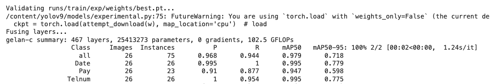
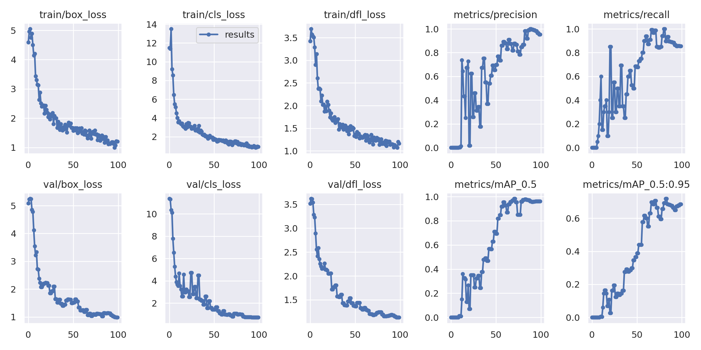

# YOLOv9を使用して領収証認識システムを構築する 

## Summary

<div style="max-width: 600px; word-wrap: break-word;">

本記事では、YOLO v9モデルを使用して、スーパーで収集した買い物の領収書を認識するシステムの構築方法について記載します。約130枚の領収書を収集し、3つのラベル（クラス）を付けてデータをアノテーションし、モデルをトレーニングしました。その結果、YOLO v9モデルは指定した3つのクラスを正確に認識することができました。

このプロジェクトは、YOLOv9を参考にして作成されています。詳細については以下のリポジトリをご参照ください：
https://github.com/WongKinYiu/yolov9

</div>


## はじめに

### YOLO v9について
<div style="max-width: 600px; word-wrap: break-word;">

YOLOは「You Only Look Once」の略で、速度と精度の高さで知られる最先端のオブジェクト検出モデルです。このモデルの第9バージョン（v9）は、「Programmable Gradient Information（PGI）」や「Generalized Efficient Layer Aggregation Network（GELAN）」といった新しいアーキテクチャを導入し、機能と性能がさらに強化されています。YOLO v9は、モデルの学習能力を向上させるだけでなく、検出プロセス全体で重要な情報を保持することを可能にし、卓越した精度と性能を実現しています。この記事はYOLO v9モデルを使用して、スーパーでの買い物領収書を認識するシステムの構築

</div>


## 準備

### 環境を選ぶ
<div style="max-width: 600px; word-wrap: break-word;">

#### トーレニングはGoogle Colabを使用します。

Google Colabは、GPUへの無料アクセスを提供するクラウドベースのプラットフォームであり、ディープラーニングモデルのトレーニングに最適な選択肢です。


#### データ準備

データの準備は最初のステップです。アノテーションツールにはいくつかの選択肢がありますが、その中でもLabelImgやLabelmeを使用した経験があります。ただし、Roboflowは非常に使いやすいツールです。今回は135枚の領収書を収集し、それらをRoboflowを使ってアノテーションしました。

Roboflowについて
Roboflowはデータセットのアノテーションを簡単かつ迅速に行い、さまざまなモデルのトレーニングに適した形式に変換できるソリューションを提供しています。無料で利用可能なRoboflowのパブリックバージョンを使用することができます。https://app.roboflow.com/

<div align="medium">
    
</div>


ここでは、135枚の領収書サンプルをRoboflowアカウントにアップロードしてアノテーションを行います。このプロジェクトでは、領収書から以下の3つのラベルを抽出します：『合計』、『日付』、『電話番号』。そのため、それぞれのラベル名を入力し、各領収書サンプルのアノテーションを作ります。


<div align="medium">
    


アノテーションが完了したら、いくつかの前処理を行います。例えば、データセットを訓練用、検証用、テスト用に分割することや、画像の拡張（既存の画像から新しい訓練用サンプルを作成するプロセス）を行います。拡張手法としては、彩度の調整、反転、グレースケール変換などがあります。また、画像を640x640サイズにリサイズします（現在のYOLO v9は640x640サイズの画像しか処理できないため、このステップは必須です）。

これらの前処理を行った結果、データセットの87枚が訓練用、26枚を検証用、12枚はテスト用として準備されました。


<div align="medium">
    

</div>


データセットの作成が完了したら、Roboflowの「Export Dataset」オプションを使用して、YOLO v9モデル用のデータセットをエクスポートできます。エクスポートしたデータセットコードを取得し、このコードをColab上で使用してモデルの訓練を行います。


## Google Colabでトーレニングの流れ

それでは、Colab上でYOLO v9モデルを使用してデータセットをどのように訓練するかを見ていきましょう。まず、Colabの「ランタイムのタイプを変更」オプションからハードウェアアクセラレータをT4 GPUに変更します。その後、YOLOv9のリポジトリをGithubからGoogleドライブにクローンする必要があります。そのために、Googleドライブをマウントしてリポジトリをクローンし、以下のコードを使用して必要なファイルやパッケージをすべてインストールします。

###  Google Drive　を接続に

```python
from google.colab import drive
drive.mount('/content/drive')
```

### Clone and Install　クローンとインストール

Clone YOLO v9 repository into your Google Drive.

```python
!git clone https://github.com/SkalskiP/yolov9.git
%cd yolov9
!pip install -r requirements.txt -q
```

## モデルをダウンロード

リポジトリをクローンして必要なファイルをインストールした後、ディレクトリを作成し、以下のコードを実行してすべての重み（モデル）をダウンロードして保存することができます。

```python
!wget -P {HOME}/weights -q https://github.com/WongKinYiu/yolov9/releases/download/v0.1/yolov9-c.pt
!wget -P {HOME}/weights -q https://github.com/WongKinYiu/yolov9/releases/download/v0.1/yolov9-e.pt
!wget -P {HOME}/weights -q https://github.com/WongKinYiu/yolov9/releases/download/v0.1/gelan-c.pt
!wget -P {HOME}/weights -q https://github.com/WongKinYiu/yolov9/releases/download/v0.1/gelan-e.pt
```

## データセットをダウンロード
次に、Roboflowで作成したデータセットをインポートします，その前に、Roboflowパッケージをインストールする必要があります。

```python
!pip install roboflow
from roboflow import Roboflow
rf = Roboflow(api_key="xxxxxxx")
project = rf.workspace().project("projectname")
version = project.version(version number)
dataset = version.download("yolov9")
```

## Train YOLO Model on reciepts　領収書データをトーレニング

その後、データセットを使ってYOLOモデルを訓練するためのトレーニングコードを実行します。ここでは、gelan-c weight.ptを使用してデータセットを訓練します。訓練を始める前に、モデルの設定ファイル（ここでは gelan-c.yaml）内のアンカー数を、データセットでアノテーションしたラベルの数に変更してください（この記事は３と使います）。モデルをより正確にするために、100エポックで訓練を行いました。ただし、必要に応じてエポック数を変更することも可能です。

```python
%cd {HOME}/yolov9

!python train.py \
--batch 8 --epochs 100 --img 640 --device 0 --min-items 0 --close-mosaic 15 \
--data invoice_extraction-3/data.yaml \
--weights {HOME}/weights/gelan-c.pt \
--cfg models/detect/gelan-c.yaml \
--hyp hyp.scratch-high.yaml
```

## 訓練の結果

これでモデルの訓練が完了しました。モデルを100エポックで訓練した結果、全クラスにおいて平均適合率（mean average precision）が0.95という良好な精度を達成しました。

 <div align="medium">
    
</div>
Accuracy and Precision of the trained YOLO-v9 model

 <div align="medium">
    
</div>
Graph showing the model performance


## Validate Trained Model by using test images
   

```python
import glob
from IPython.display import Image, display

for image_path in glob.glob(f'{HOME}/yolov9/runs/detect/exp2/*.jpg')[:3]:
      display(Image(filename=image_path, width=600))
      print("\n")
```
 <div align="medium">
    
</div>

 <div align="medium">
    
</div>


